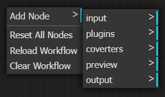

# 1.1 Varieties of Nodes

The node system currently provides the following categories: Input, Plugins, Converters, Preview, and Output.

Input Node: This serves as the entry point for loading data that requires processing. Each pipeline must have exactly one Input Node - no more, no less.

Plugin Nodes: These are algorithmic nodes that execute either pre-configured or user-defined Python code to perform computational operations on the data.

Converter Nodes: These nodes handle data format conversions and transformations.

Preview Nodes: These invoke preview interface, allowing users to visualize both the raw data and intermediate data generated during the processing pipeline.

Output Node: This node determines whether and in what format the results should be saved to file.

