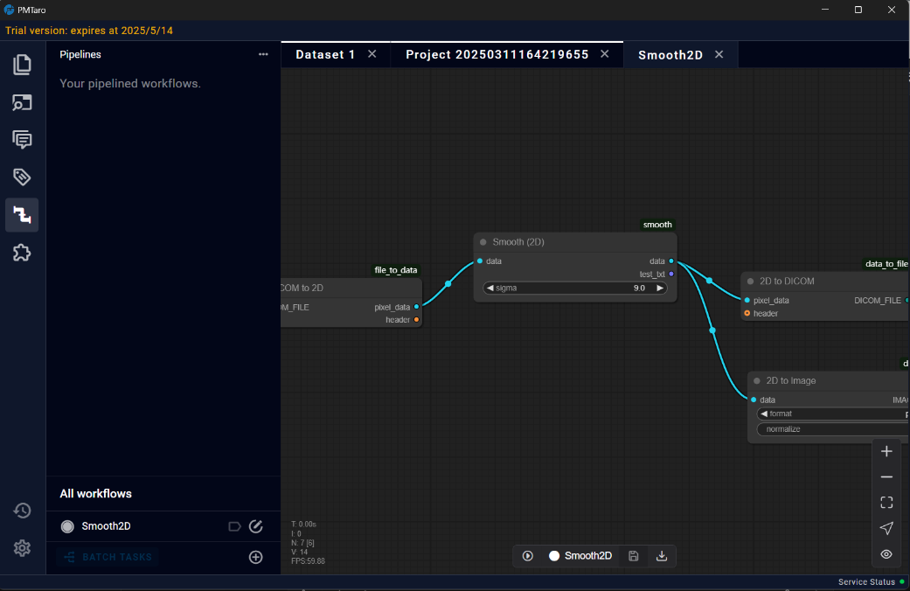
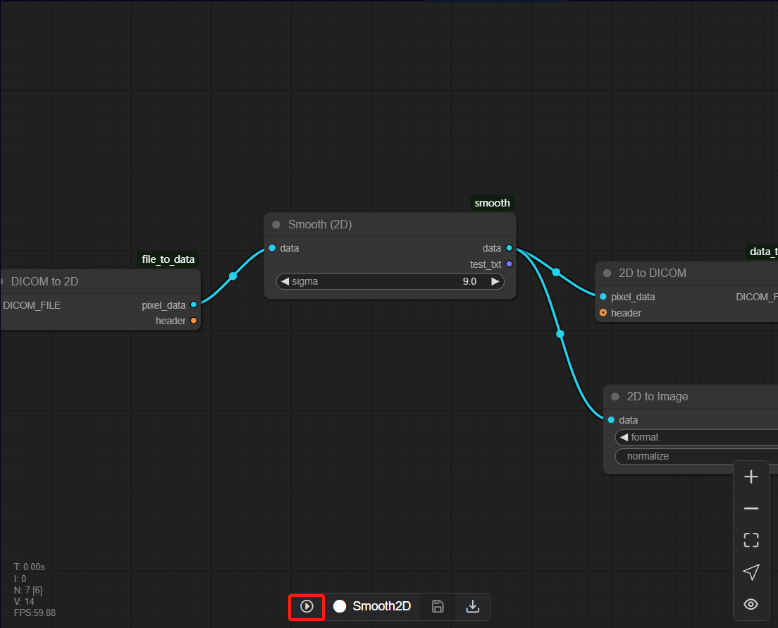
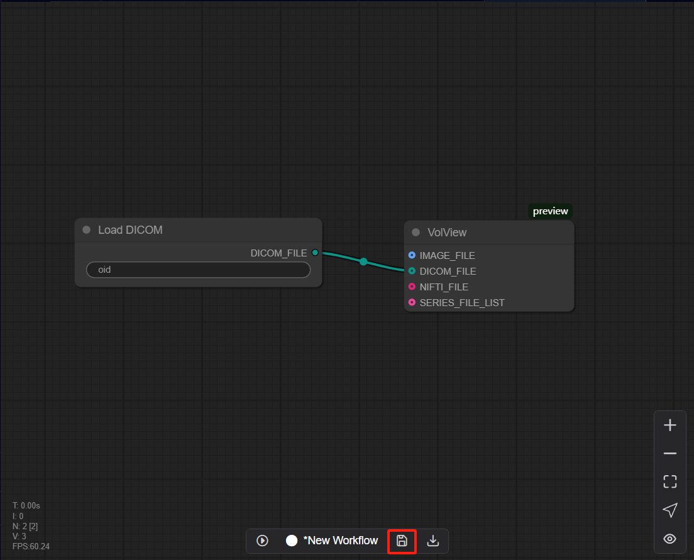
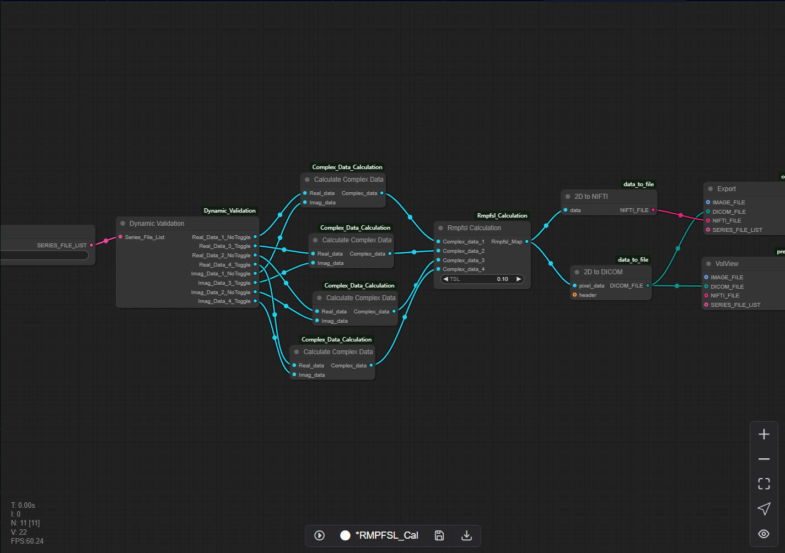

# 10 Pipelines Page (MPF Post-processing)

The MPF post-processing pipeline module offers users a versatile and flexible tool for customizing and executing data processing workflows through pipeline configuration and data management. Currently, this module is primarily utilized for MPF post-processing, providing multiple pipelines tailored for specific post-processing of MPF data. The plugin module allows users to design and upload their own data processing algorithms as plugins to meet specific standards. Users can integrate these plugins, each with unique functionalities, into coherent pipelines within the platform. This enables users to process data individually or in batch mode while maintaining supervision over the derivatives and results generated during the processing operations.

## 10.1 New Pipeline

In the Pipelines section, there is a "New" button at the bottom. Clicking this button will automatically direct users to the pipeline interface, where users can design custom pipelines according to their specific requirements.

Each pipeline must contain an Input Node, but a pipeline consisting of only an Input Node is not valid. Once users have completed the pipeline design, click the Save button to preserve configuration.

## 10.2 Pipeline Control Panel

Located at the bottom of the interface, this section provides pipeline execution controls and management functions.

### 10.2.1 Execute Pipeline

### 10.2.2 Rename Pipeline

### 10.2.3 Save Change

### 10.2.4 Export Pipeline

## 10.3 View Control Panel

Situated in the lower right corner, this section manages display settings and visualization options.

### 10.3.1 Zoom In / Out

### 10.3.2 Fit View

### 10.3.3 Select Mode

### 10.3.4 Toggle Link Visibility 

##  10.4 Smooth Processing Pipeline (Auto)

The Smooth Processing Pipeline is an automated workflow composed of sequential processing nodes. Once the input parameters are configured, users can initiate the pipeline by clicking the Execute button, after which the backend will automatically execute all nodes in pipeline. Users can review the data by Preview node.

* Firstly, there are two methods available for adding data:
* 
Method 1: Data Drag-and-Drop from Project Interface

* In the project interface, locate the data you wish to process
* Click and hold the mouse button on the desired data
* Drag the selected data to the pipeline option at the top of the interface
* The system will automatically navigate to the pipeline interface
* Continue dragging the data to the corresponding node
* Release the mouse button to initiate automatic data loading
Important Note: Ensure that the data type of your selected file matches the data type specified in the Input Node. Type mismatches will not be processed.

The second method allows users to directly input the OID of the target data into the Input Node field within the pipeline interface.

Method 2: Direct OID Input
Simply enter the OID (Object Identifier) of the data users wish to process directly into the Input Node in the pipeline interface.

* Once the input data is properly configured, click the Execute button to initiate data processing. After the processing is complete, users can examine the results using the Preview Node.

## 10.5 MPF Phase Map Calculation Pipeline (Auto)

The MPF Phase Map Calculation Pipeline is a dedicated workflow architecture optimized for MPF scan sequence analysis. The current computational framework is implemented to generate MPF Phase Map and Phase Mask.

## 10.6 RMPFSL Map Calculation Pipeline (Auto)

The RMPFSL Map Calculation Pipeline is a dedicated workflow architecture optimized for MPF scan sequence analysis. The current computational framework is implemented to generate RMPFSL Maps.

## 10.7 MPF Map Calculation Pipeline (Auto)

The MPF Map Calculation Pipeline is a dedicated workflow architecture optimized for MPF scan sequence analysis. The current computational framework is implemented to generate MPF Maps.

