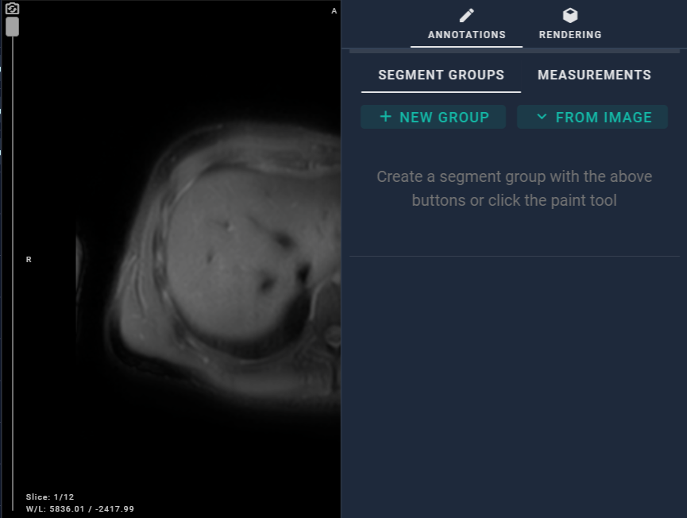
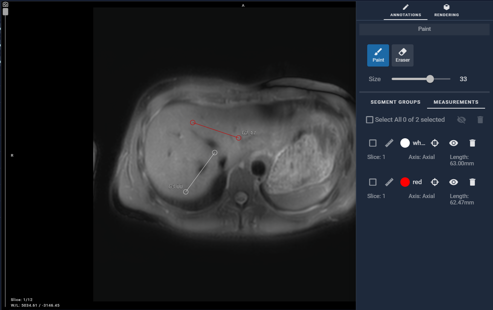
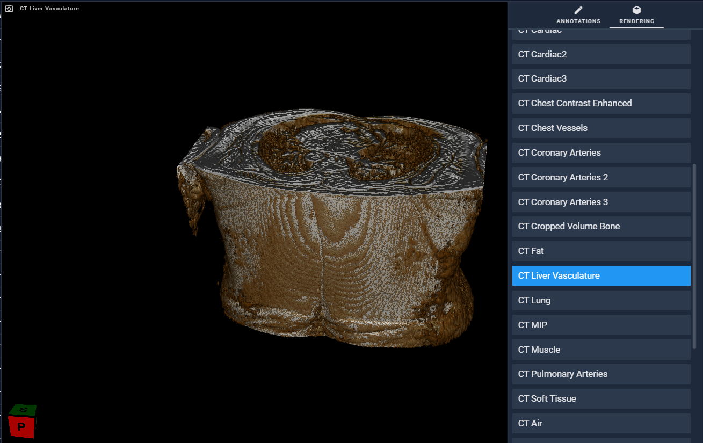
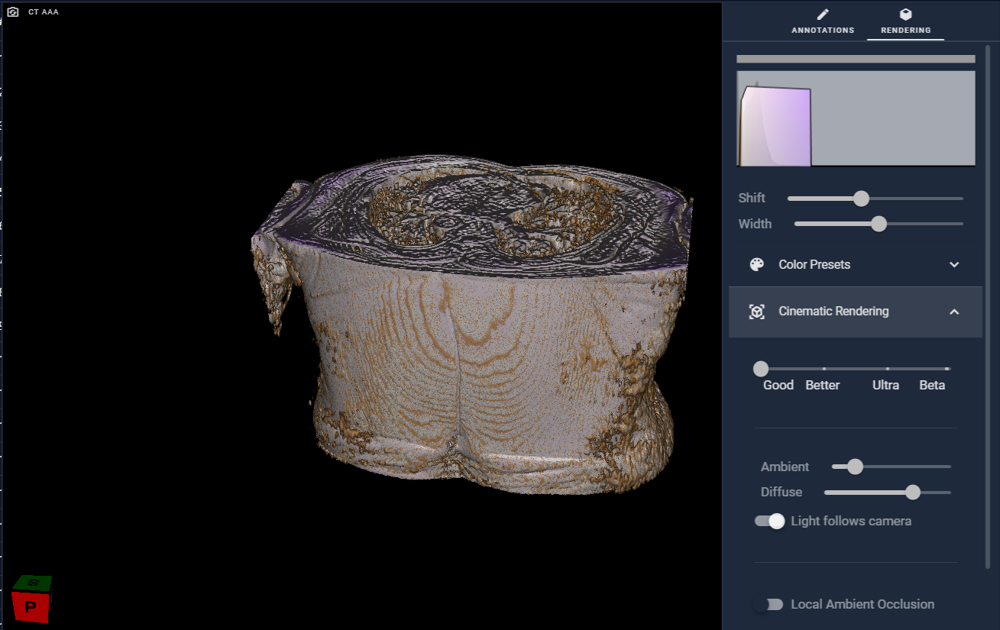

# 2.1 Interaction Info List

In the toolbar on the right-hand side, the first button is "Interaction Info List", which consists of two sections: "Annotation" and "Rendering".

Annotation: This module contains two sections: one part is about segment information, and the other part is about measurements information.

When the user is using the Paint tool, this list allows for setting properties of Paint tool. The upper part allows users to select the brush or eraser for drawing and adjust the brush size and ROI area transparency. The lower part is for managing multiple ROI groups, where each ROI group can be custom-named, hidden, downloaded, and deleted. The ROI group colors can be added, selected, and named.

When the user is using the measurement tool, users can also view completed annotations in this list. For completed measurements, users can perform operations such as reveal slice, visibility toggle, and delete.

Rendering: The module allows users to render data and adjust settings for cinematic rendering.

