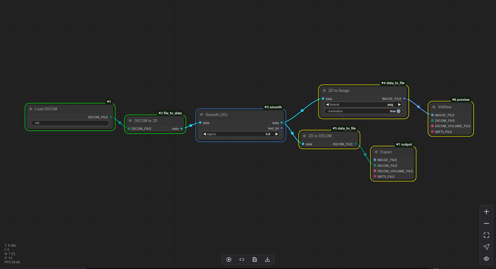

# 2.1 Node status description

The workflow consists of multiple nodes, each of which exhibits distinct visual states during editing and execution phases.

During Editing:
Nodes can display three states:

Unselected nodes appear without borders

Selected nodes are highlighted with a white border, and their associated input/output links are also displayed in white

Nodes with initialization errors are marked with a red border, indicating the need for definition correction

During Execution:
Nodes transition through four distinct states:

Current: Indicated by a blue border, representing the node currently being processed

Pending: Marked with a yellow border, signifying nodes awaiting processing

Done: Displayed with a green border, denoting successfully completed nodes

Error: Highlighted with a red border, indicating nodes that encountered processing exceptions

The visual state system employs consistent color coding to provide immediate feedback on node status, facilitating efficient workflow monitoring and management.

