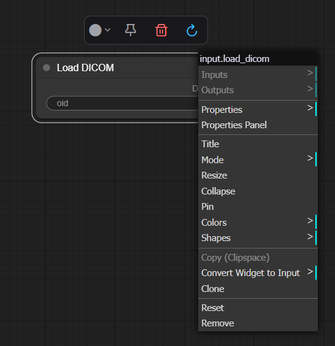

# 2.2 Node Setting

Right-click on a node in the workspace to access node-specific menu operations for the currently selected node. The Toolbar functions from left to right are: Reset Color, Pin, Delete, and Update Definition.The options panel on the right provides specific controls corresponding to each selected item's properties and settings.

