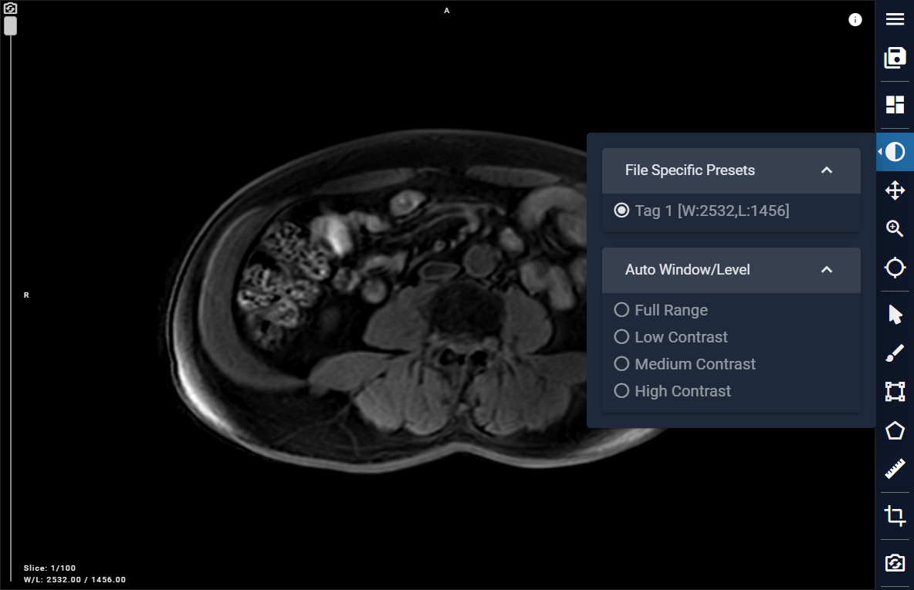
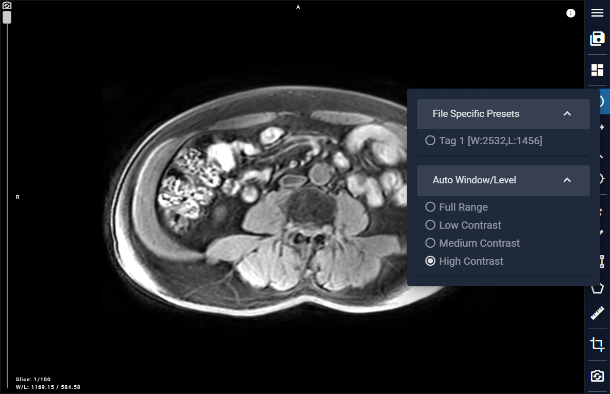

# 2.3 Window/Level (Contrast)

This button enables contrast adjustment functionality. We have incorporated default settings for image reading, along with four additional options: Full Range, Low Contrast, Medium Contrast, and High Contrast. Users can conveniently select these options based on their requirements. Users can also hold down the left mouse button on the image and move up and down to adjust the window level, and left and right to adjust the window width.

