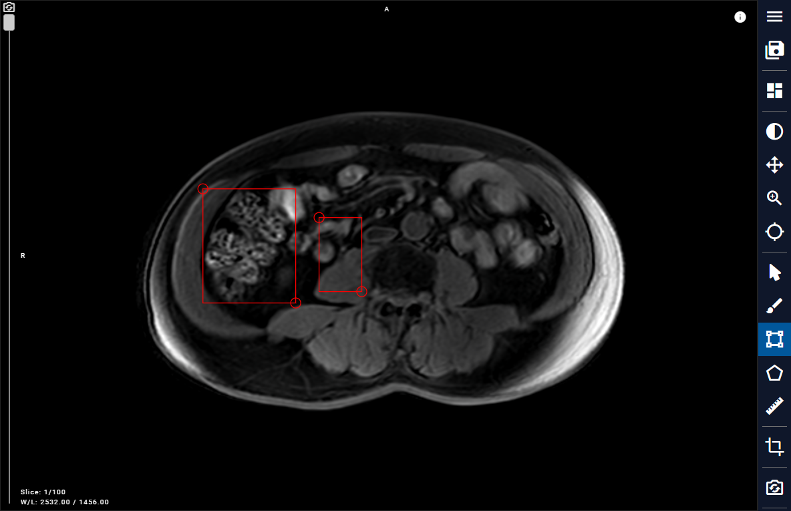

# 2.8 Rectangle (Measurement)

In the Toolbar, click on the Rectangle button, then utilize the brush tool to select the ROI area on the image. Begin by selecting the starting point, and then confirm the endpoint to finish drawing a rectangular ROI.

