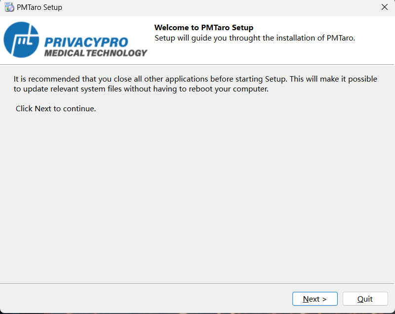
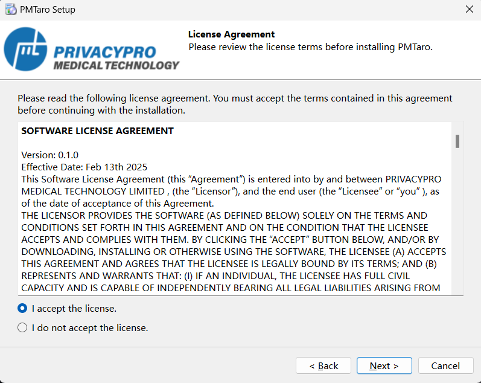
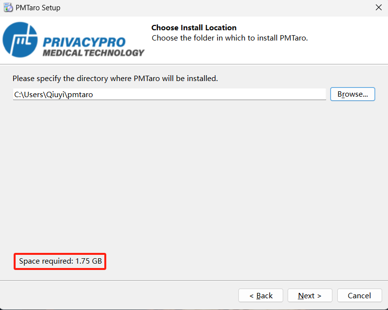
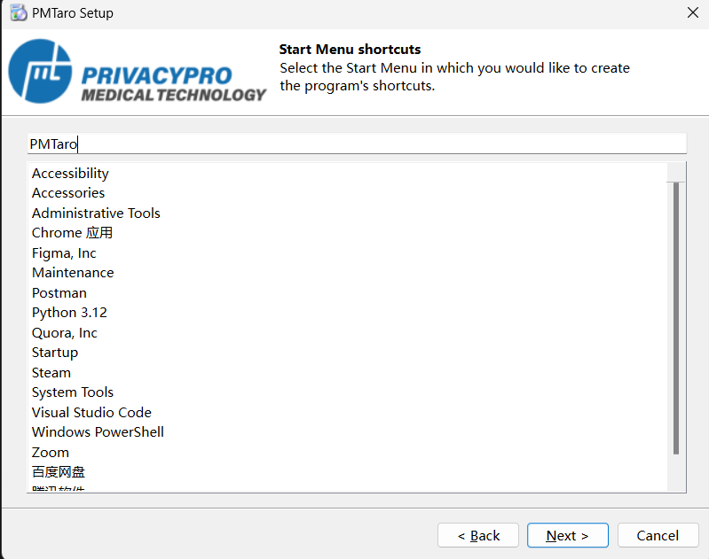
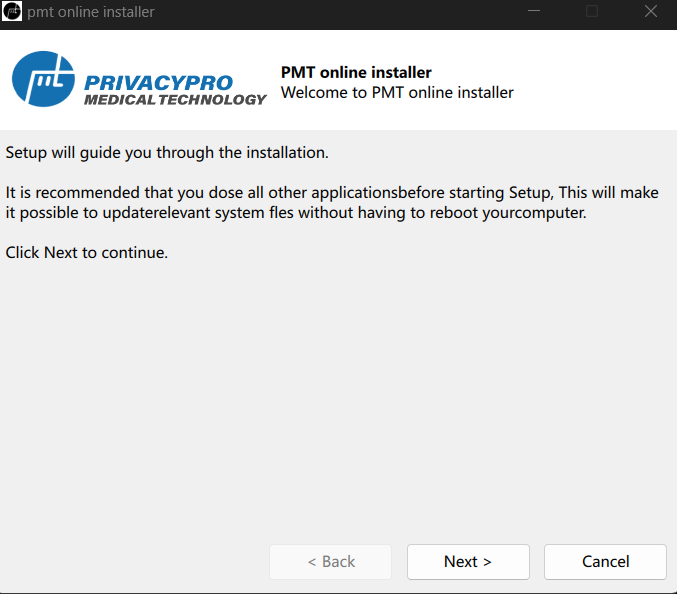
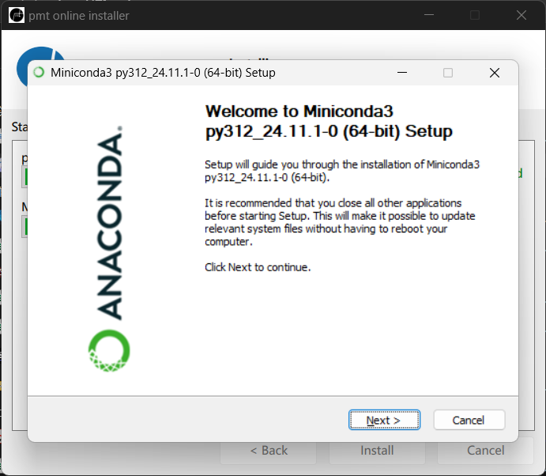
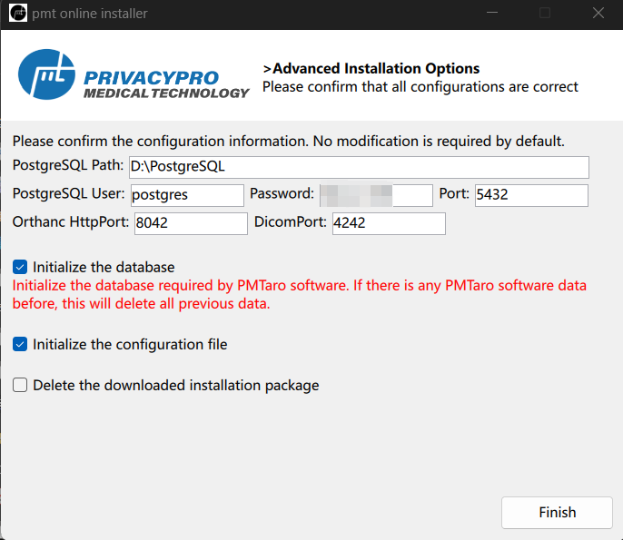

# 3 Installation and Setup

## 3.1 Download PMTaro installer & Run setup wizard

Step 1：Launch the PMTaro installation package and click "Next" to proceed with the installation process.

Step 2: Review the license agreement carefully. The software installation requires your acceptance of the terms and conditions stated in this agreement before proceeding. Once you have read and agreed to the terms, click "Next" to continue.

Step 3: Select your preferred installation directory, ensuring sufficient disk space is available for the installation (minimum 500MB required). Click "Next" to proceed with the installation.

Step 4: The default settings will create convenient quick-launch icons. Click "Next" to continue.

Step 5: The installation is now ready to begin. For optimal performance and ease of access, we recommend maintaining the default configuration settings. Click "Install" to commence the installation process.

Step 6: The software installation has been successfully completed! 

## 3.2 Configuration

Step 1: We will enter the software configuration stage, which is designated for configuring the software's database and operational environment. Please click "Next" at this point to proceed.

Step 2: Then, we will select the necessary components for installation. All of these components must be installed for the software correctly; hence they are all pre-selected by default. Please ensure all components are checked and then click the "Next" button. If users have already installed the corresponding components locally, they can skip the installation step and proceed directly to configuration.

Step 3: It is recommended to proceed with the default process for the installation packages that appear and complete the installation as prompted.

Step 4: Finally, we will reach the configuration interface. Users can choose to end the process directly at this point by selecting the default option, thus completing all installation steps.

