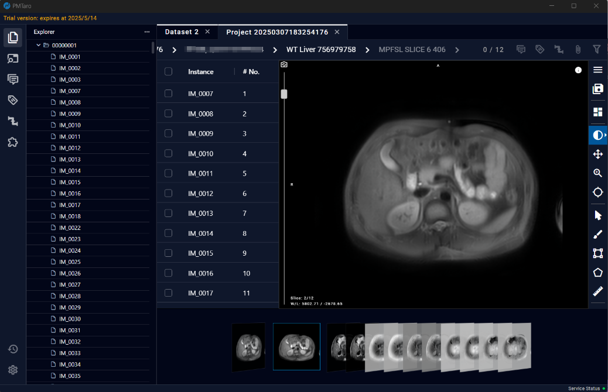

# 4 Dataset Browing Page

The Dataset Browsing Page provides an interface for browsing, editing, and annotating data. Users can perform operations such as adjusting contrast, rotating, and translating data.

