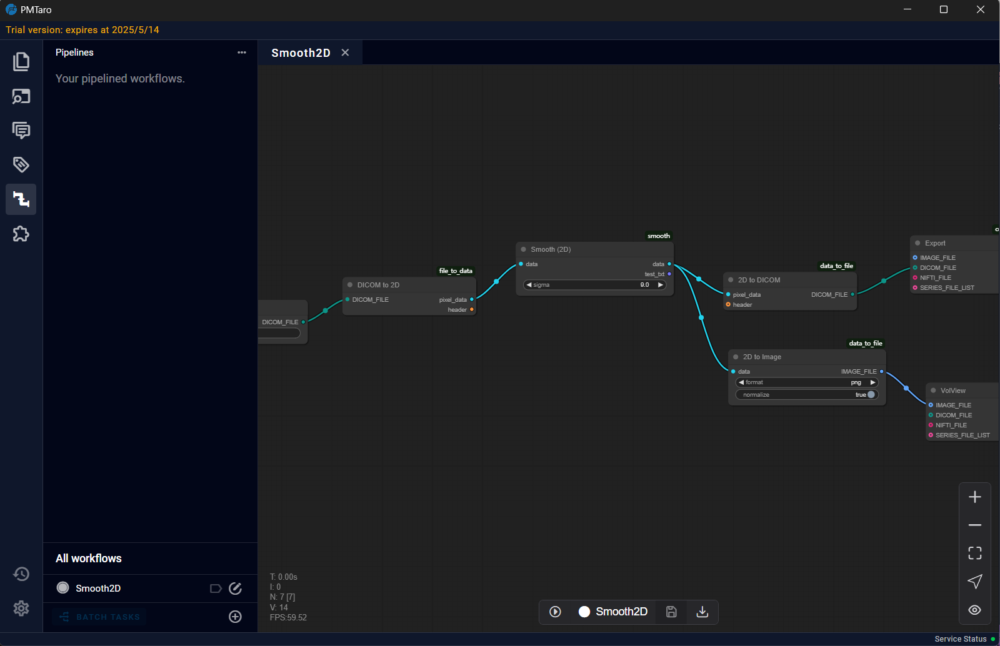

# 4 Software Page Overview

## 4.1 Welcome Page

Upon opening the software, the initial welcome interface will be presented. The toolbar on the far left, from top to bottom, corresponds to the following pages: Explorer Page, DICOM Tags Page, Reports Page, Labels Page, Pipelines Page, and Plugins Page. The left drawer column will display the column information of the currently selected page. The majority of the right-hand side area constitutes the main interface, serving as the primary operational area for different pages. 

## 4.2 Dataset Parse Page

The Dataset Parse Page enables users to view the file structure of the currently selected folder and categorize and manage data files according to their needs.

## 4.3 Dataset Detail Page

The Dataset Detail Page will provide a detailed display of the data information within the dataset and offer image previews.

## 4.4 Dataset Browing Page

The Dataset Browsing Page provides an interface for browsing, editing, and annotating data. Users can perform operations such as adjusting contrast, rotating, and translating data.

## 4.5 Pipelines Page

The Pipelines Page provides a pipeline editing and running interface. Users can not only invoke MPF data processing workflows here but also customize data flows according to their requirements.

