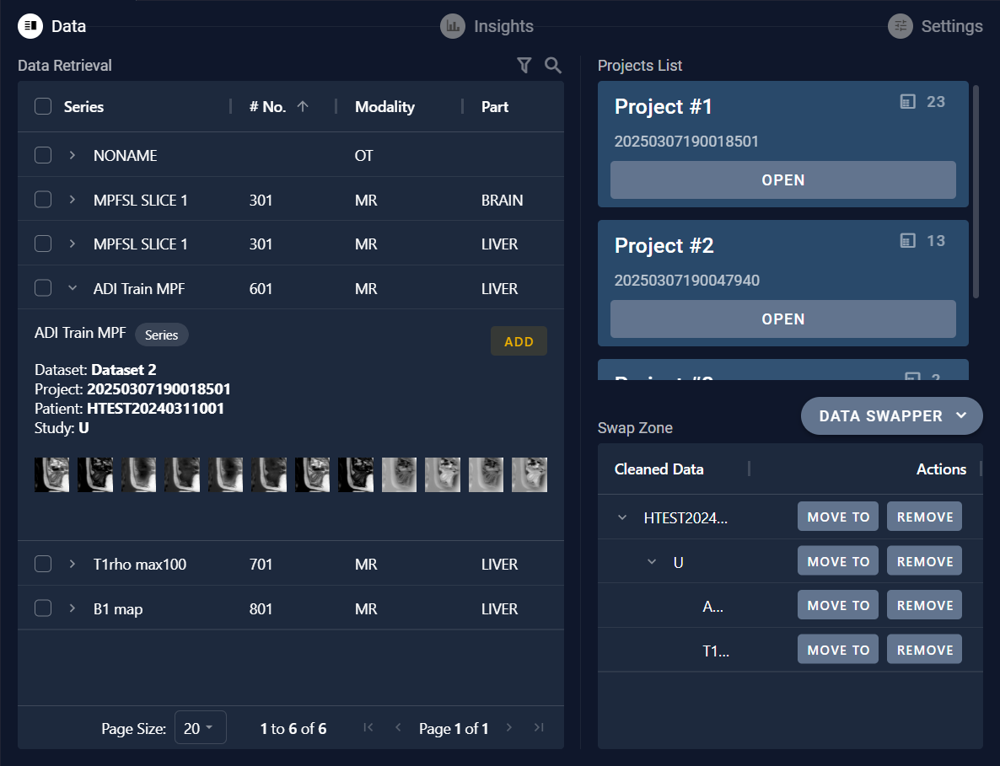

# 8.2 Move Data

For the data retrieved, clicking on the arrow next to the series name allows you to view the data details. If you need to move the data, you can click the "ADD" button to add the data to the swap zone. Then, in the swap zone area, you can move or delete the data between projects.

