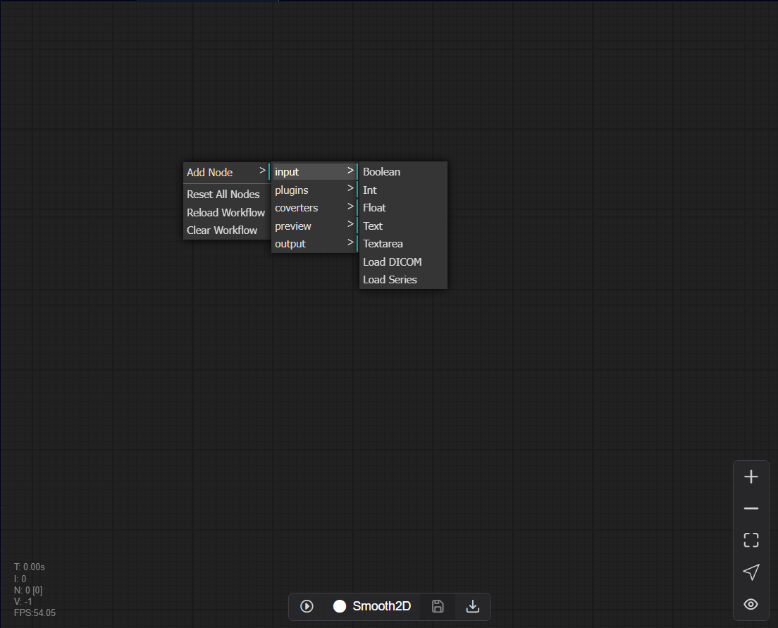
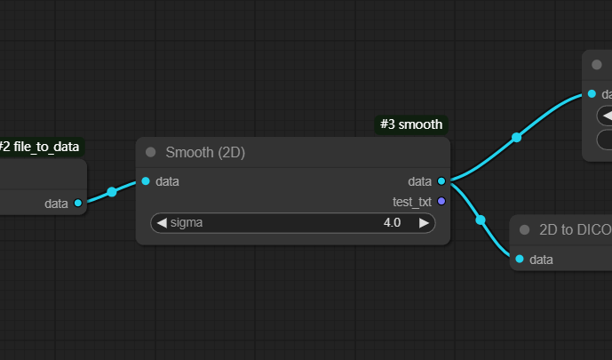
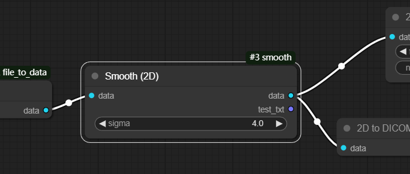

# 9 Plugin Page 

Each pipeline consists of multiple nodes, which come in various types, each serving different functions. Plugins serve as nodes used to implement data processing algorithms.

## 9.1 Node

### 9.1.1 Varieties of Nodes

The node system currently provides the following categories: Input, Plugins, Converters, Preview, and Output.

* Input Node: This serves as the entry point for loading data that requires processing. Each pipeline must have exactly one Input Node - no more, no less.
* Plugin Nodes: These are algorithmic nodes that execute either pre-configured or user-defined Python code to perform computational operations on the data.
* Converter Nodes: These nodes handle data format conversions and transformations.
* Preview Nodes: These invoke preview interface, allowing users to visualize both the raw data and intermediate data generated during the processing pipeline.
* Output Node: This node determines whether and in what format the results should be saved to file.

### 9.1.2 Add Node

Right-click on any blank area of the workspace to access the main menu operations. Select the desired option to add it to workflow.

### 9.2.2 Node Setting

Right-click on a node in the workspace to access node-specific menu operations for the currently selected node. The Toolbar functions from left to right are: Reset Color, Pin, Delete, and Update Definition.The options panel on the right provides specific controls corresponding to each selected item's properties and settings.

### 9.2.1 Node status description

The workflow consists of multiple nodes, each of which exhibits distinct visual states during editing and execution phases.

* During Editing:
Nodes can display three states:
* Unselected nodes appear without borders
* 

* 
* Selected nodes are highlighted with a white border, and their associated input/output links are also displayed in white
* 

* 
* Nodes with initialization errors are marked with a red border, indicating the need for definition correction

* During Execution:
Nodes transition through four distinct states:
* Current: Indicated by a blue border, representing the node currently being processed
* Pending: Marked with a yellow border, signifying nodes awaiting processing
* Done: Displayed with a green border, denoting successfully completed nodes
* 

* 
* Error: Highlighted with a red border, indicating nodes that encountered processing exceptions

The visual state system employs consistent color coding to provide immediate feedback on node status, facilitating efficient workflow monitoring and management.

## 9.2 Plugin 

To add a new plugin in the Plugin section, two files are required:

A configuration file in JSON format that describes and defines the plugin's specifications and parameters.

A Python file containing the executable code for data processing.

Users can input these files in two ways:

Drag and drop the files directly from their local system to the input area

Click the input field to open a file selection dialog

Once both files are selected, click "Import" to complete the upload process. Note that both files must conform to specific format requirements. If the format requirements are not met, error messages will be displayed, indicating that modifications to the plugin content are necessary.

After successful import, the newly imported plugin will appear in the plugin list below. To utilize this newly added plugin in the pipeline interface, right-click and select "Reload Workflow". Important: Please ensure you save any existing modifications before reloading, as this action will reset unsaved changes.

