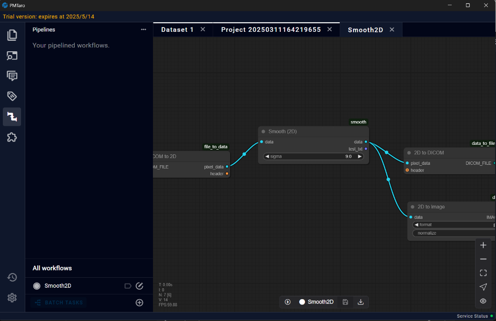

# Pipelines Page (MPF Post-processing)

The MPF post-processing pipeline module offers users a versatile and flexible tool for customizing and executing data processing workflows through pipeline configuration and data management. Currently, this module is primarily utilized for MPF post-processing, providing multiple pipelines tailored for specific post-processing of MPF data. The plugin module allows users to design and upload their own data processing algorithms as plugins to meet specific standards. Users can integrate these plugins, each with unique functionalities, into coherent pipelines within the platform. This enables users to process data individually or in batch mode while maintaining supervision over the derivatives and results generated during the processing operations.

