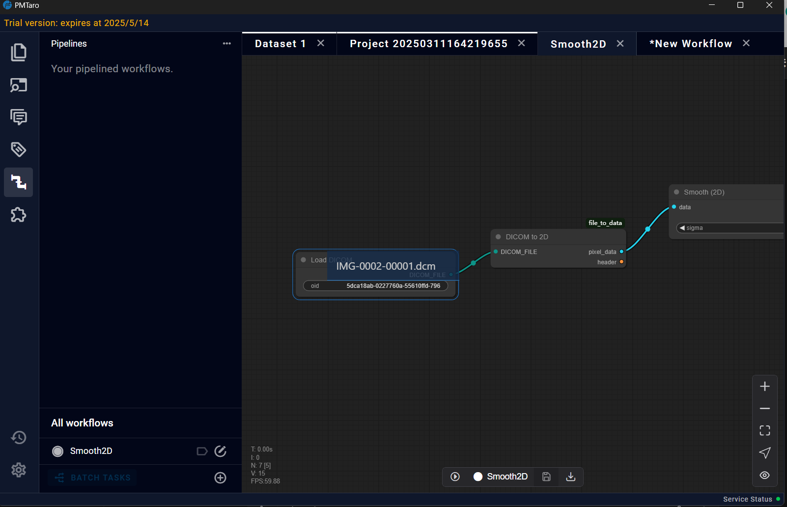
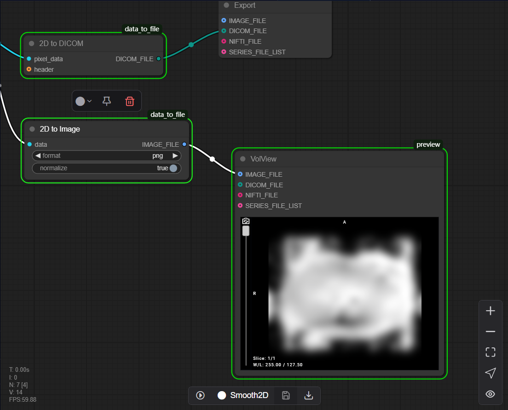

# 10.3 View Control Panel

Situated in the lower right corner, this section manages display settings and visualization options.

## 10.3.1 Zoom In / Out

## 10.3.2 Fit View

## 10.3.3 Select Mode

## 10.3.4 Toggle Link Visibility 

#  10.4 Smooth Processing Pipeline (Auto)

The Smooth Processing Pipeline is an automated workflow composed of sequential processing nodes. Once the input parameters are configured, users can initiate the pipeline by clicking the Execute button, after which the backend will automatically execute all nodes in pipeline. Users can review the data by Preview node.

* Firstly, there are two methods available for adding data:
* 
Method 1: Data Drag-and-Drop from Project Interface

* In the project interface, locate the data you wish to process
* Click and hold the mouse button on the desired data
* Drag the selected data to the pipeline option at the top of the interface
* The system will automatically navigate to the pipeline interface
* Continue dragging the data to the corresponding node
* Release the mouse button to initiate automatic data loading
Important Note: Ensure that the data type of your selected file matches the data type specified in the Input Node. Type mismatches will not be processed.

The second method allows users to directly input the OID of the target data into the Input Node field within the pipeline interface.

Method 2: Direct OID Input
Simply enter the OID (Object Identifier) of the data users wish to process directly into the Input Node in the pipeline interface.

* Once the input data is properly configured, click the Execute button to initiate data processing. After the processing is complete, users can examine the results using the Preview Node.

