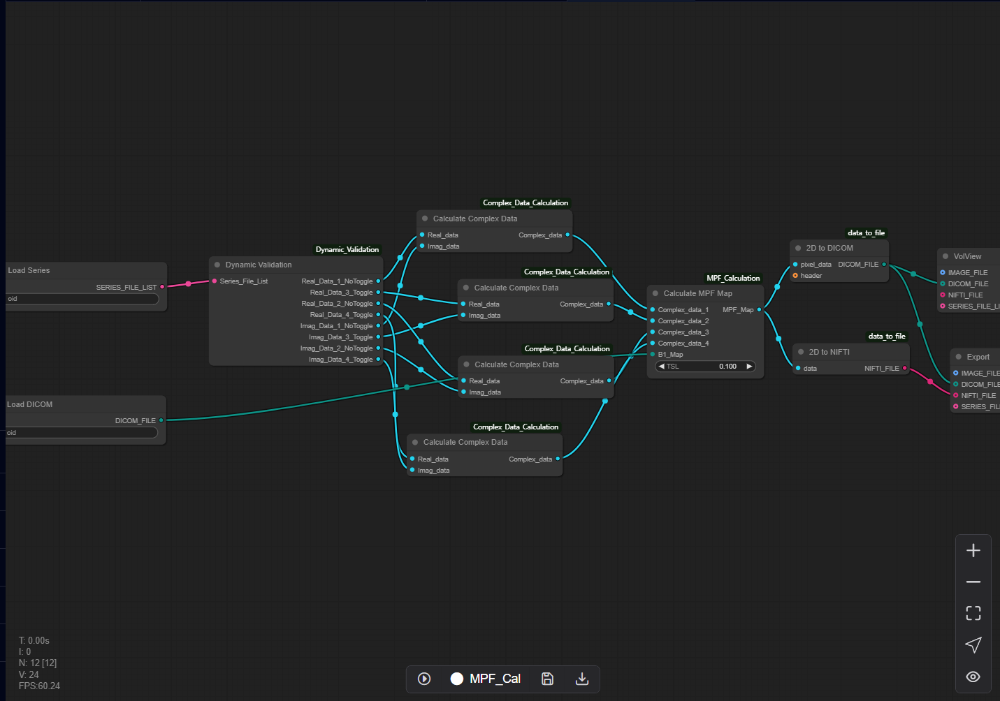

# 10.7 MPF Map Calculation Pipeline (Auto)

The MPF Map Calculation Pipeline is a dedicated workflow architecture optimized for MPF scan sequence analysis. The current computational framework is implemented to generate MPF Maps.

