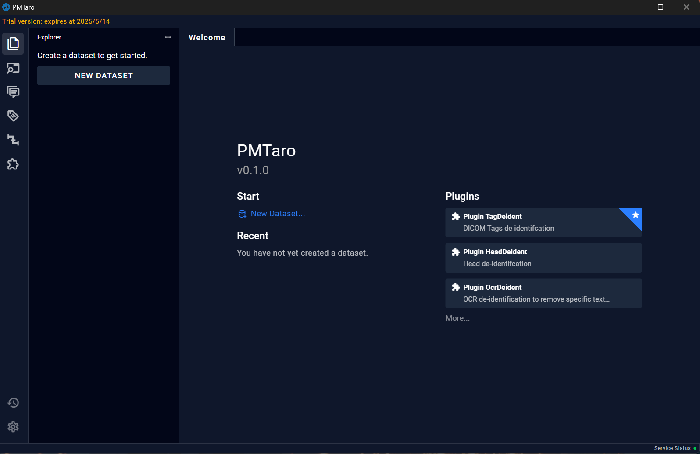

# 4.1 Welcome Page

Upon opening the software, the initial welcome interface will be presented. The toolbar on the far left, from top to bottom, corresponds to the following pages: Explorer Page, DICOM Tags Page, Reports Page, Labels Page, Pipelines Page, and Plugins Page. The left drawer column will display the column information of the currently selected page. The majority of the right-hand side area constitutes the main interface, serving as the primary operational area for different pages. 

