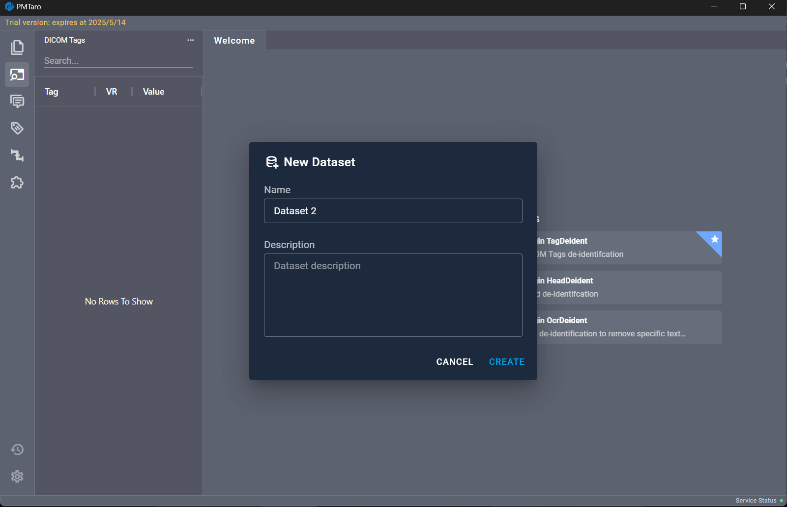
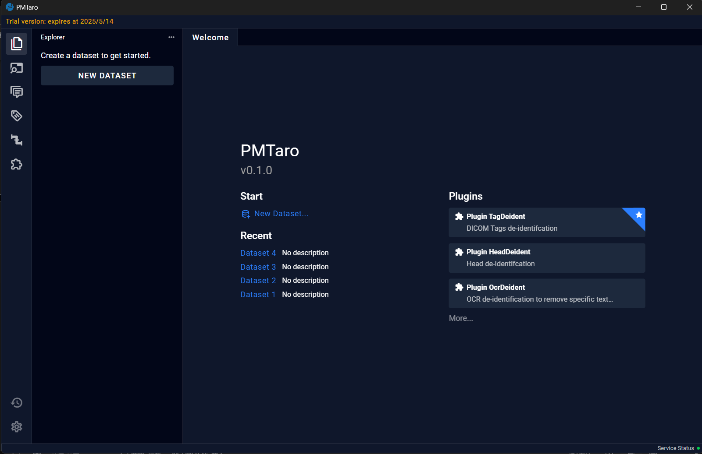

# 5 Welcome Page 

## 5.1 New Dataset

To create a new dataset, click on "New Dataset" on the welcome interface. A popup window will appear where users can fill in the necessary information. After completing the information, clicking "CREATE" will finalize the creation of the dataset.

## 5.2 Recent Dataset

If a dataset has already been created, users can directly open the established dataset by clicking on the name of the dataset under "Recent."

