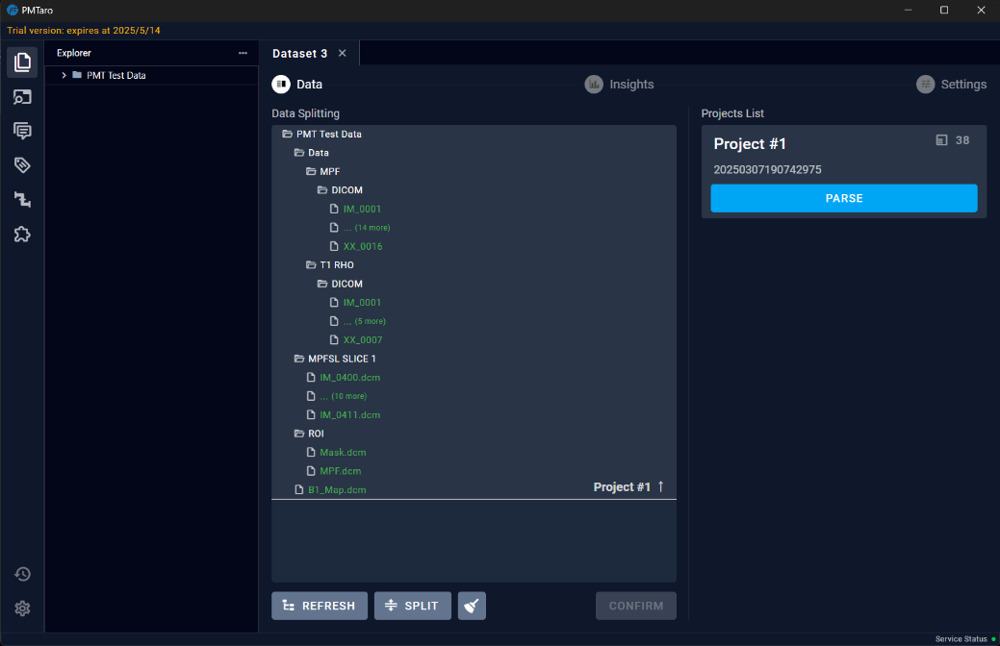
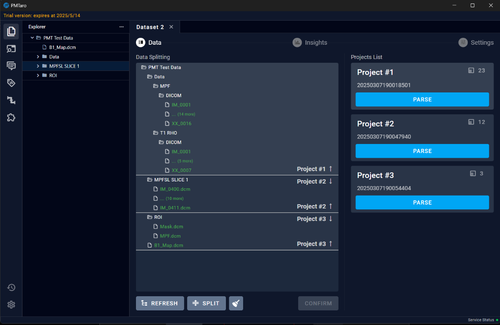
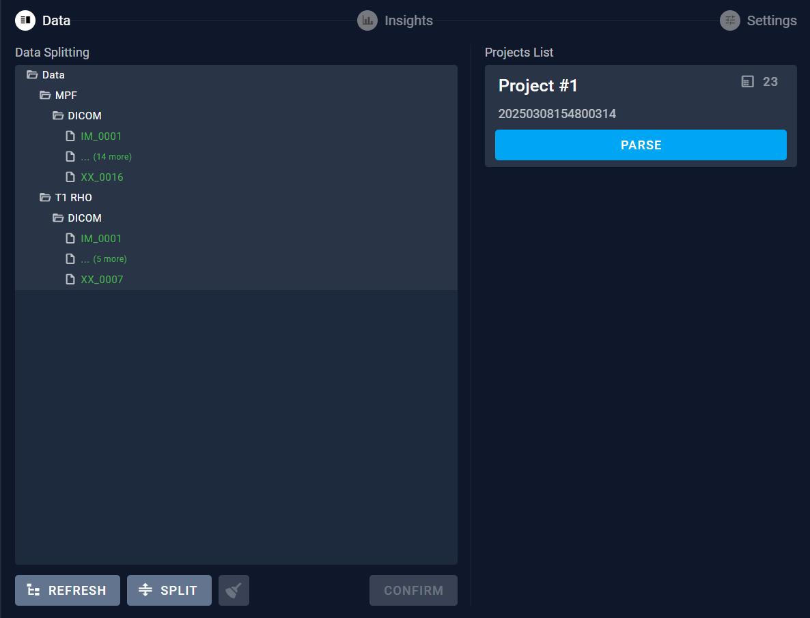
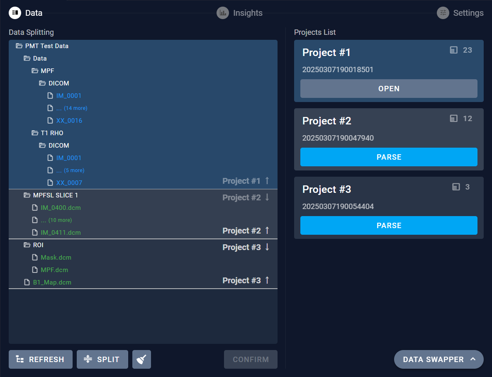
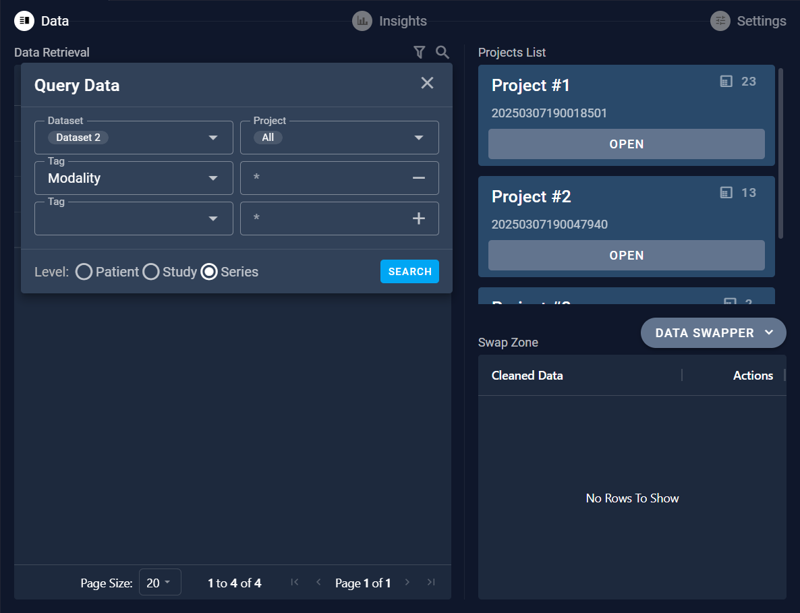
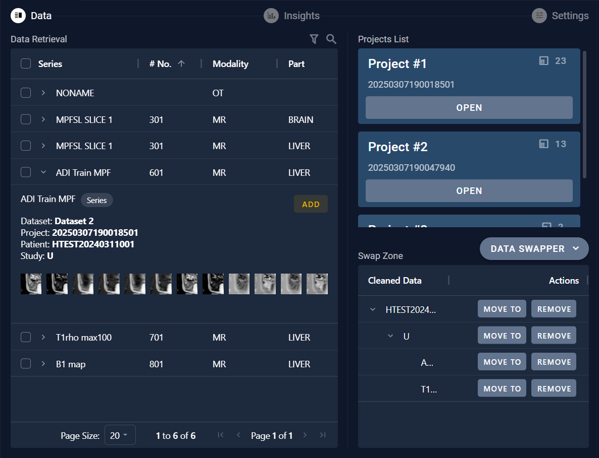
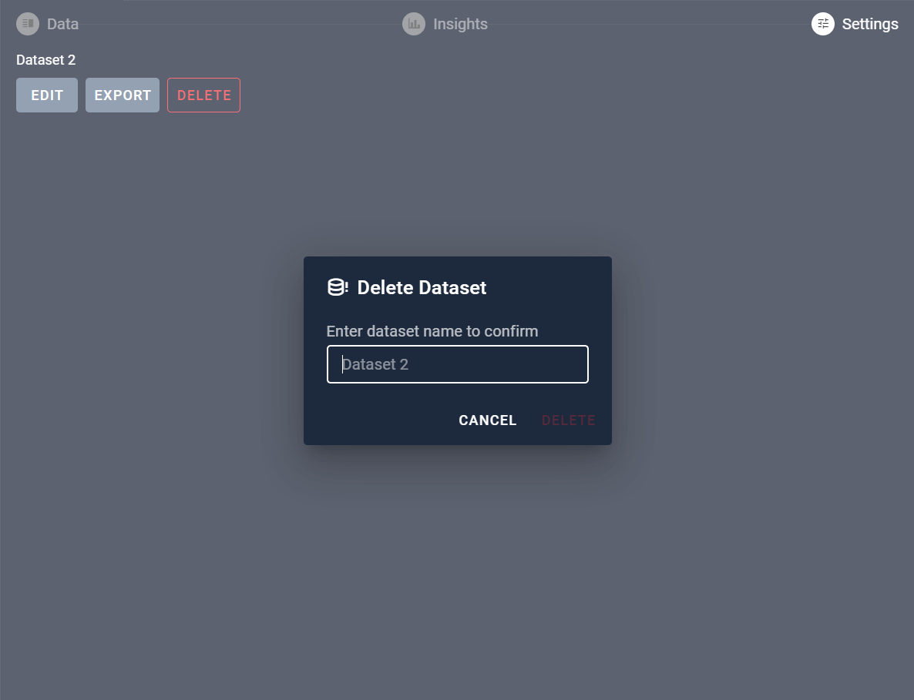

# 6 Dataset Parse Page 

## 6.1 Add Folder

After creating a new folder, users will navigate to the dataset parsing page where they need to add the folder path of the data to be processed. By clicking on the "ADD FOLDER" button in the "Explorer" section on the left, users can select the local folder path.

## 6.2 Prepare Dataset

After adding the folder address, the "PREPARE" button on the main interface's right side will become active. At this point, users can directly click the button to trigger the default manual split and parse. Users can also click the three dots next to the button and select automatic split and parse mode.

The interface after parsing is displayed below:

Within the "Explorer" section, users can continue to add new folders.

## 6.3 Refresh

The refresh button allows users to reload the file structure information within the currently added folders.

## 6.4 Manually Split

To manually split data, users can click on the white dividing line that separates the data. When the dividing line is selected, it will turn yellow. At this point, users can use the "↑" key on the keyboard to adjust the position of the dividing line, allowing for manual classification of the data.

Note: After completing the operation, you must click the "CONFIRM" button.

## 6.5 Automatic Split

For automatic splitting, within the split button, select the desired number of categories, and then click the "SPLIT" button.

Note: After completing the operation, you must click the "CONFIRM" button.

## 6.6 Broom

Clicking the broom icon will hide the white dividing line.

## 6.7 Parse

Clicking the "PARSE" button will parse the data within the selected project. Once the parsing is complete, the "Parse" button will change to "OPEN".

## 6.8 Data swapper

After completing the parsing process, a "DATA SWAPPER" button will appear in the bottom right corner of the page. Clicking this button will open a "Data Retrieval" interface where users can perform operations such as searching for data and moving it.

### 6.8.1 Query Data

Users can query the data by setting different search criteria to retrieve specific information from the dataset.

### 6.8.2 Move Data 

For the data retrieved, clicking on the arrow next to the series name allows you to view the data details. If you need to move the data, you can click the "ADD" button to add the data to the swap zone. Then, in the swap zone area, you can move or delete the data between projects.

## 6.9 Settings

On the Settings page, users can perform data export and deletion.

### 6.9.1 Export

The Export button provides various export options for users to choose export format.

### 6.9.2 Delete

The delete button provides an additional verification step to prevent accidental deletions.

