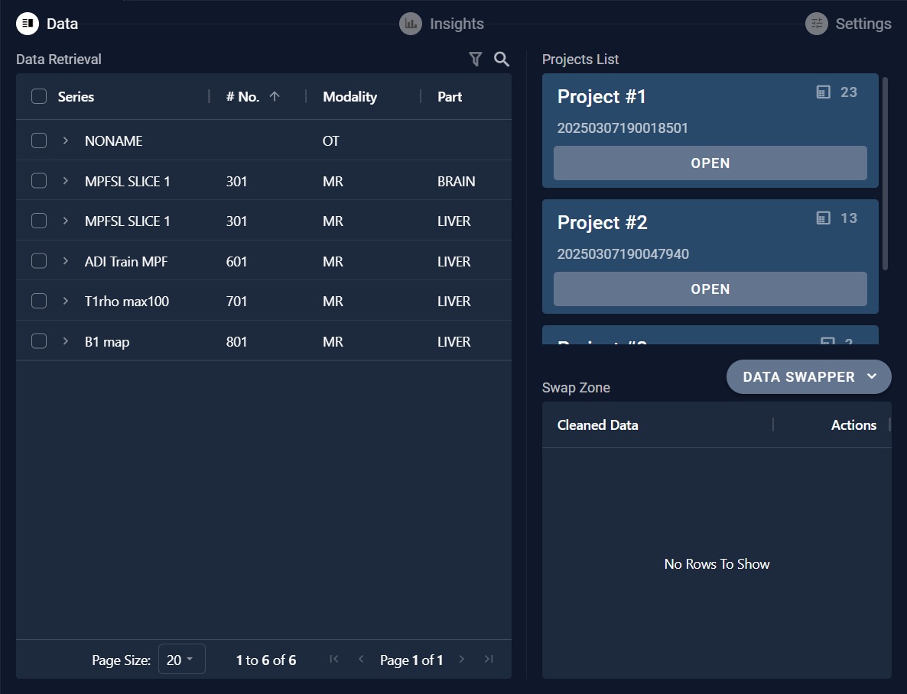

# 6.8 Data swapper

After completing the parsing process, a "DATA SWAPPER" button will appear in the bottom right corner of the page. Clicking this button will open a "Data Retrieval" interface where users can perform operations such as searching for data and moving it.

## 6.8.1 Query Data

Users can query the data by setting different search criteria to retrieve specific information from the dataset.

## 6.8.2 Move Data 

For the data retrieved, clicking on the arrow next to the series name allows you to view the data details. If you need to move the data, you can click the "ADD" button to add the data to the swap zone. Then, in the swap zone area, you can move or delete the data between projects.

