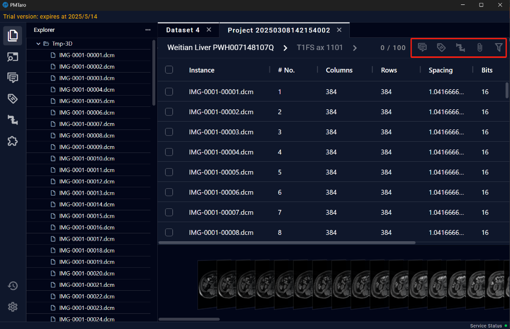
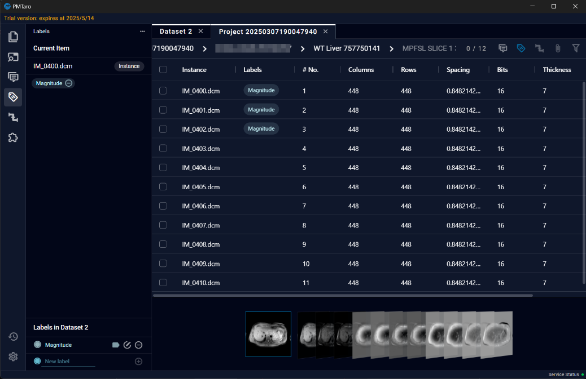
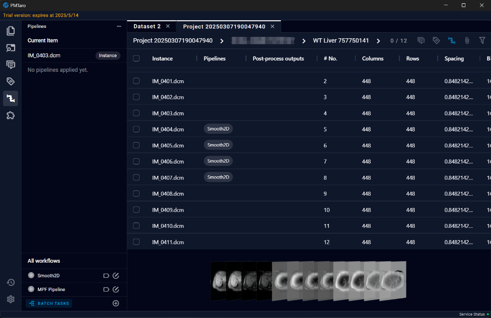
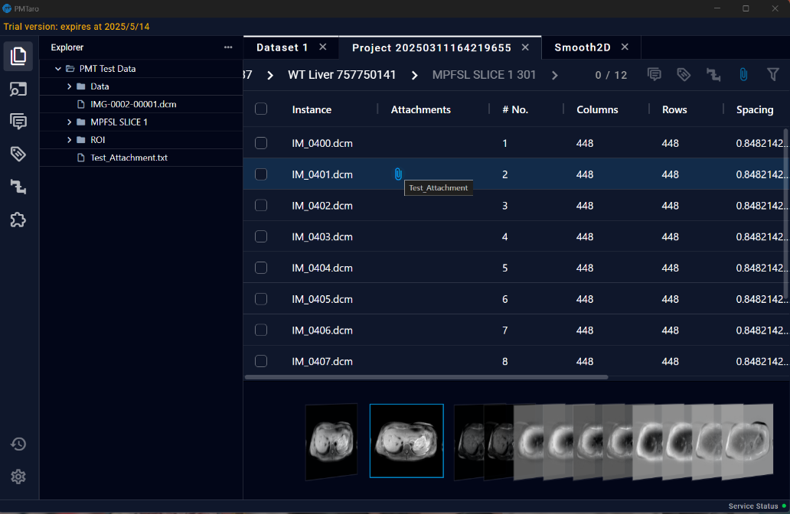
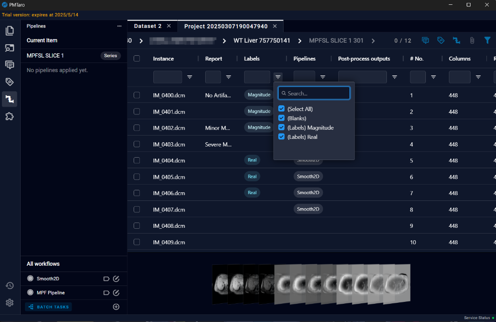

# 7 Dataset Detail Page

The Dataset Detail Page displays the data details within the dataset and provides users with the functionality to annotate the data.

## 7.1 Reports

In the Reports section, users can record report information in the text input box located in the bottom left corner. Additionally, a "Report" column will be added to the table on the screen, making it convenient for users to directly view the data reports corresponding to each data.

## 7.2 Labels

In the Labels section, users can create or edit labels in the Label list located in the bottom left corner. Users can add labels to corresponding data by using buttons. Additionally, a "Labels" column will be added to the table on the screen, making it convenient for users to view the labels associated with each data. Each data can have multiple labels assigned to it.

## 7.3 Pipelines

In the Pipelines section, users can add pipelines to process data. In the Pipeline list located in the bottom left corner, users can use buttons to assign pipelines to corresponding data. This means that when running a pipeline, all data assigned to that pipeline will be processed. Additionally, the table on the screen will include new columns for "Pipelines" and "Post-processing outputs," making it easy for users to select data to execute specific post-processing workflows and review processing results

## 7.4 Attachments

In the Attachments section, users can select attachments from the bottom left corner and assign them to corresponding data by using buttons. Additionally, a new column for "Attachments" will be added to the table on the screen.

## 7.5 Table setting & Filters

The table can display multiple annotation information and users can also filter data through filters.

