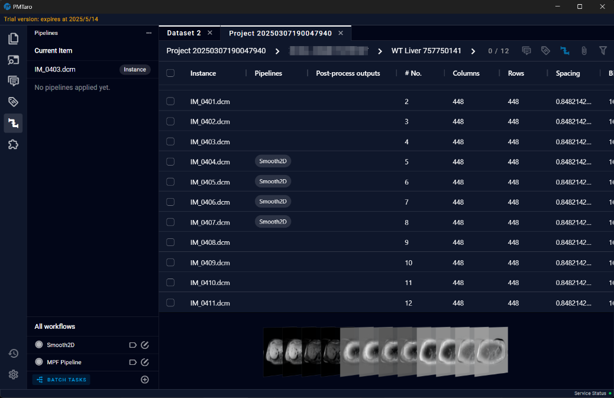

# 7.3 Pipelines

In the Pipelines section, users can add pipelines to process data. In the Pipeline list located in the bottom left corner, users can use buttons to assign pipelines to corresponding data. This means that when running a pipeline, all data assigned to that pipeline will be processed. Additionally, the table on the screen will include new columns for "Pipelines" and "Post-processing outputs," making it easy for users to select data to execute specific post-processing workflows and review processing results

