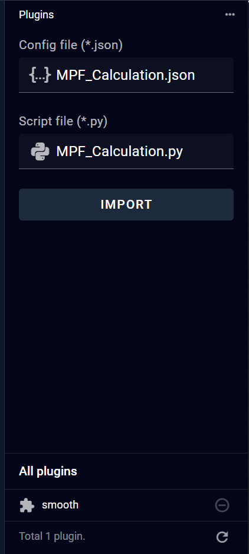

# 9.2 Plugin 

To add a new plugin in the Plugin section, two files are required:

A configuration file in JSON format that describes and defines the plugin's specifications and parameters.

A Python file containing the executable code for data processing.

Users can input these files in two ways:

Drag and drop the files directly from their local system to the input area

Click the input field to open a file selection dialog

Once both files are selected, click "Import" to complete the upload process. Note that both files must conform to specific format requirements. If the format requirements are not met, error messages will be displayed, indicating that modifications to the plugin content are necessary.

After successful import, the newly imported plugin will appear in the plugin list below. To utilize this newly added plugin in the pipeline interface, right-click and select "Reload Workflow". Important: Please ensure you save any existing modifications before reloading, as this action will reset unsaved changes.

