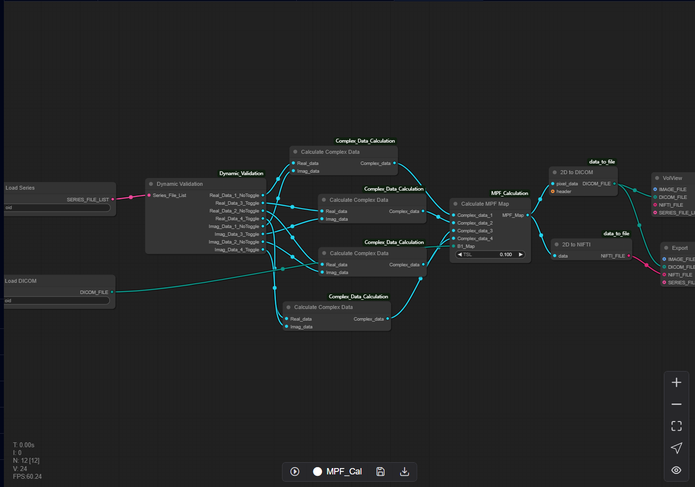

# 10.6 RMPFSL & MPF Map Calculation Pipeline (Auto)
The RMPFSL & MPF Map Calculation Pipeline is a dedicated workflow architecture optimized for MPF scan sequence analysis. The current computational framework is implemented to generate RMPFSL & MPF Maps.

