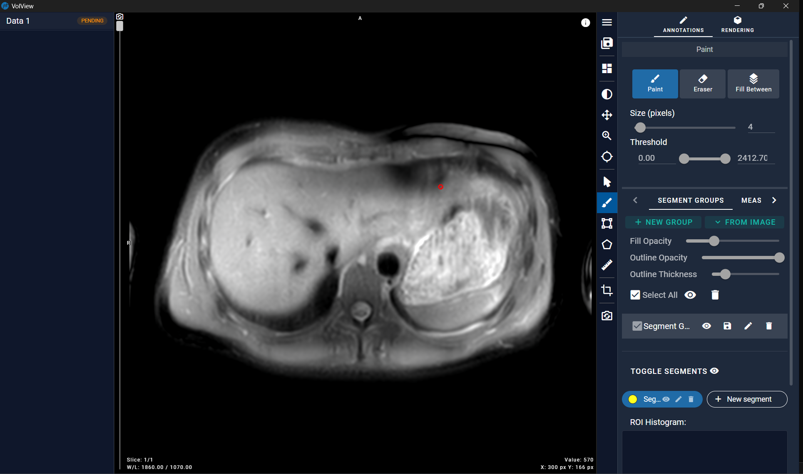
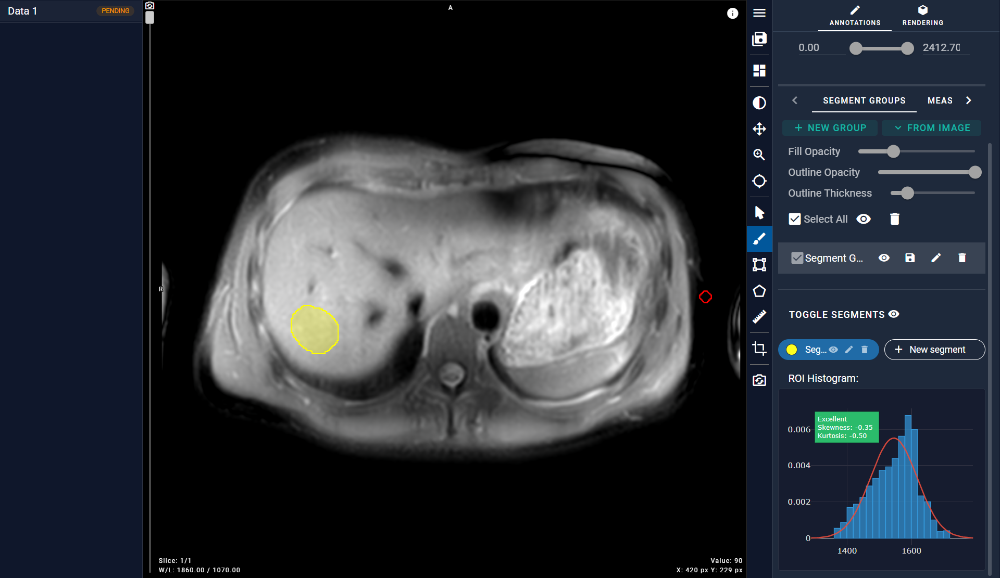
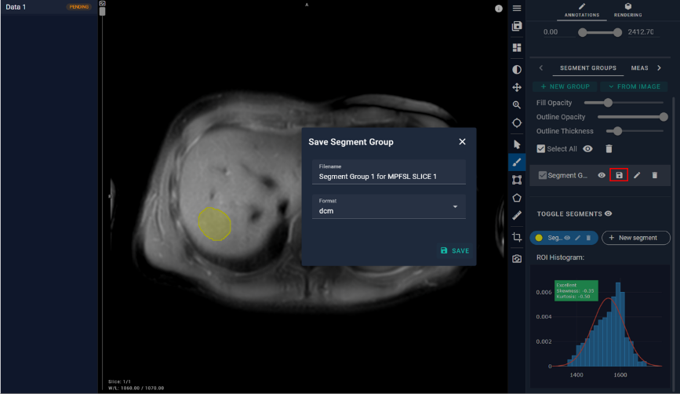
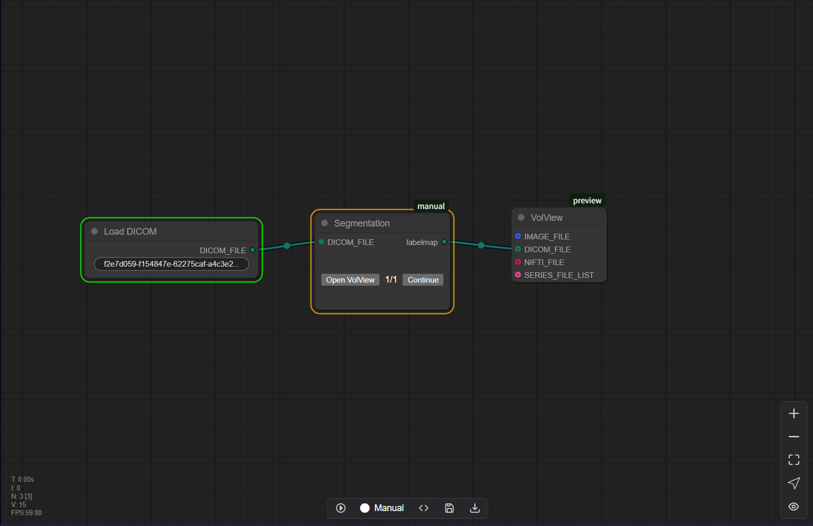
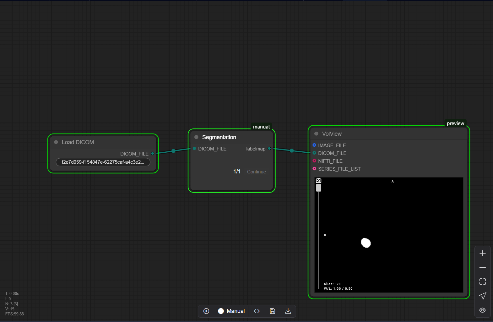

# 10.7 ROI Annotation (Manual)
A manual pipeline that can be used to annotate ROIs for derivatives or results obtained during the normal pipeline operation. Below is a simple Annotation pipeline

When the pipeline runs to the Manual node, it will stop. At this time, the user needs to manually operate and click the "Open Volview" button. Then the user will enter the ROI annotation interface.

Users can refer to the ROI histogram to ensure the rationality of the ROI.

When the annotation is completed, user needs to save the ROI, and then users can see that the data status in the upper left corner is updated to DONE. The user can close the interface

After closing the page, return to the Pipeline interface and click the Continue button to complete the subsequent processing.

