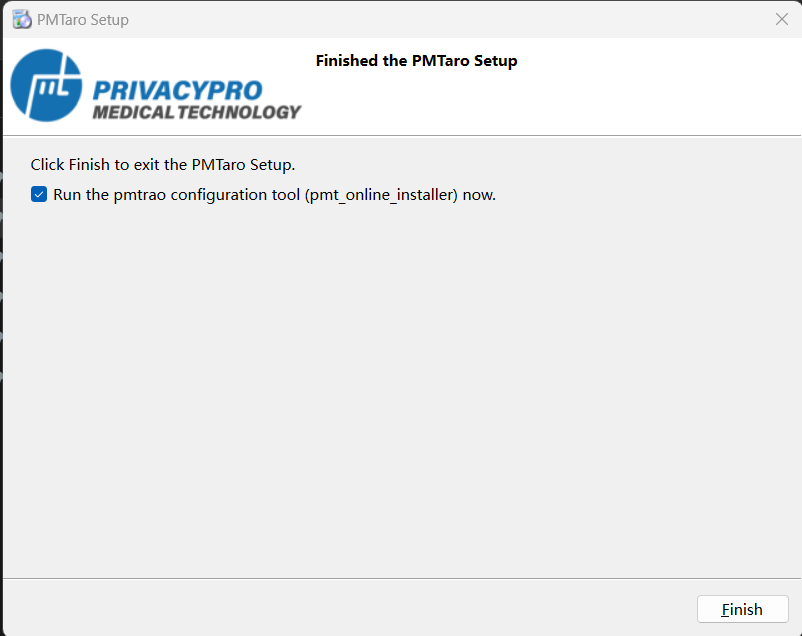
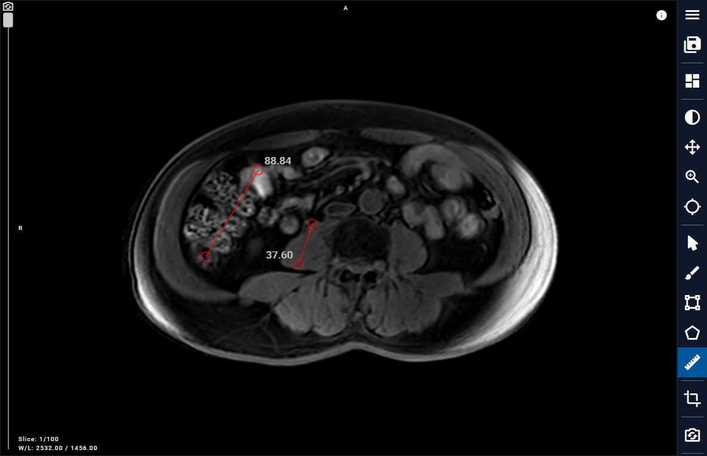
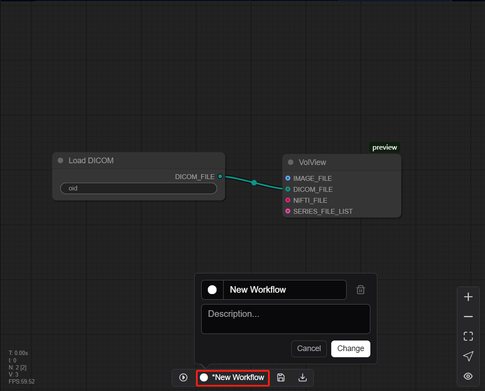
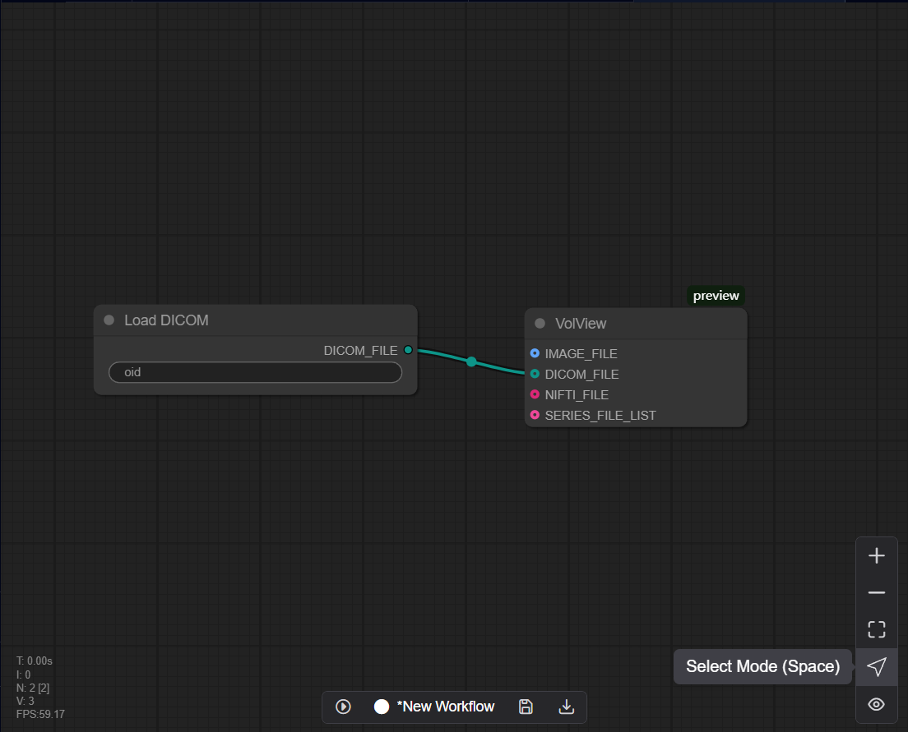

# 10.7 Batch Processing (Auto & Manual)
When users are faced with a large amount of data that needs to be processed in the same data pipeline, they can use the batch processing function.
After completing the design of the Pipeline, users can add corresponding Pipeline labels to the data in the data interface, and at the same time, hover over the data and right-click to open the option bar and add the data to Batch Tasks. Then the software will pop up the Task interface, and users can also click the Batch Tasks button in the lower right corner to enter the Tasks interface.

Note: Each data can be added to Batch Tasks multiple times, or different Pipelines can be set for processing. In the Batch Tasks interface, users can delete data by right-clicking the mouse, or filter data by using the Filter above the list.

Click the start button to start batch processing. During the running process, you can view the progress of the running by checking the Status, and you can also view the progress in the pipeline thumbnail below. When the status of all data is 100%, all data processing is completed.

Finally, return to the data interface to view the result file of the previous data processing.
