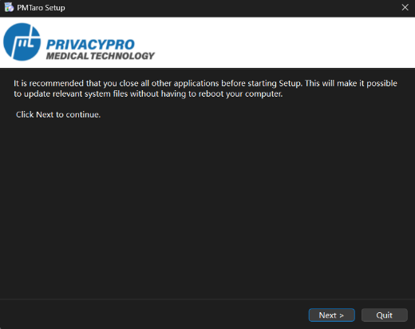
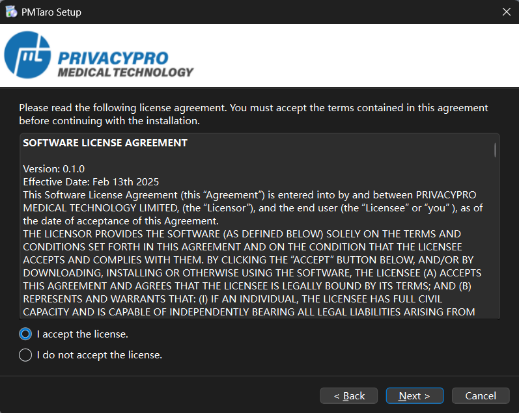
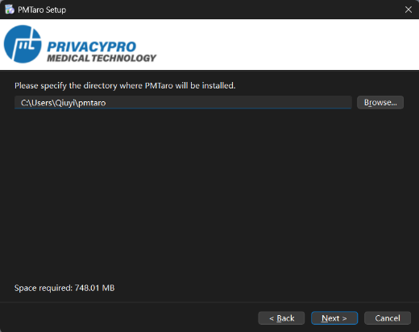

# 3.1 Download PMTaro installer & Run setup wizard
Step 1: Launch the PMTaro installation package and click "Next" to proceed with the installation process.

Step 2: Review the license agreement carefully. The software installation requires your acceptance of the terms and conditions stated in this agreement before proceeding. Once you have read and agreed to the terms, click "Next" to continue.

Step 3: Select your preferred installation directory, ensuring sufficient disk space is available for the installation (minimum 748MB required). Click "Next" to proceed with the installation.

Step 4: The default settings will create convenient quick-launch icons. Click "Next" to continue.

Step 5: The installation is now ready to begin. For optimal performance and ease of access, we recommend maintaining the default configuration settings. Click "Finish" to commence the installation process.

Step 6: The software installation has been successfully completed! 

