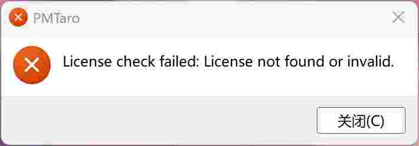
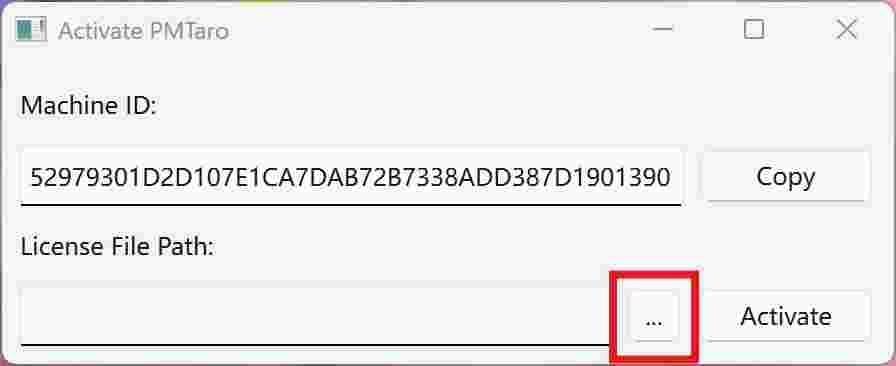
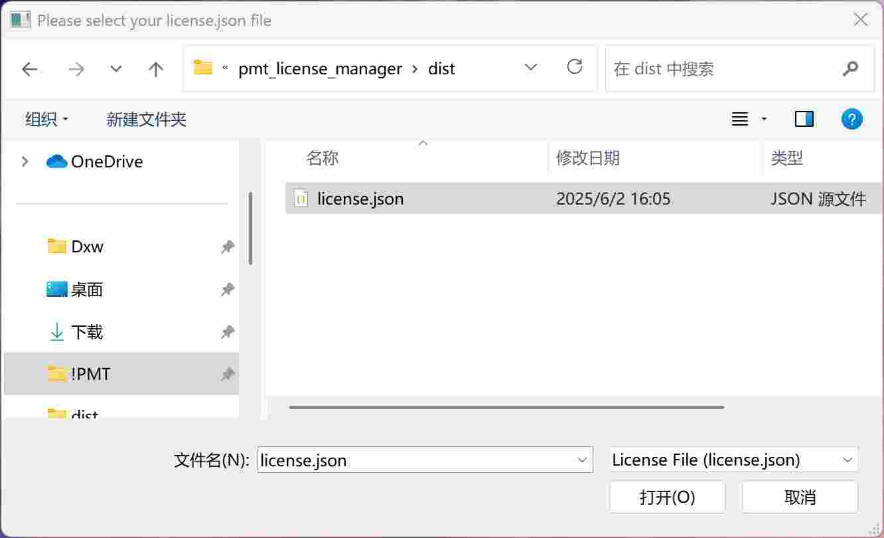
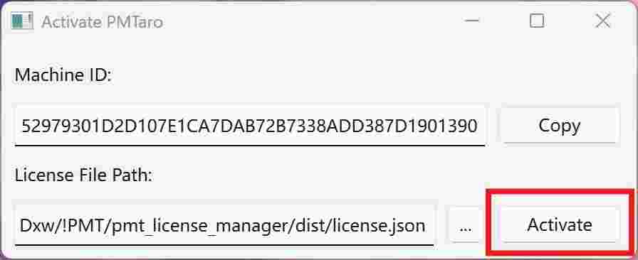
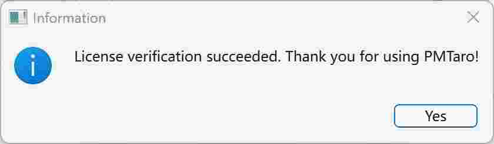

# 3.2 PMTaro Activation
Step 1: When the user runs the software for the first time, the system will pop up an "Unregistered" prompt dialog box.

Step 2: After clicking "Close", the software registration tool will open automatically. In the registration tool, click the "Copy" button to copy the Machine ID of this machine.

Step 3: Provide the copied Machine ID to the technical support staff to obtain the authorization file license.json.

Step 4: After downloading and saving the authorization file, click the "..." button in the registration tool, select the downloaded license.json file and click "Open".

Step 5: Click the "Activate" button, the system will verify the authorization file and pop up a confirmation prompt box after successful registration.

Step 6: Software registration successful.
