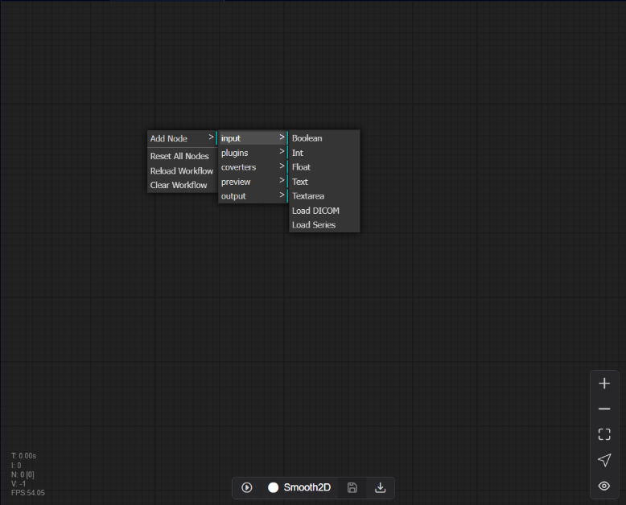
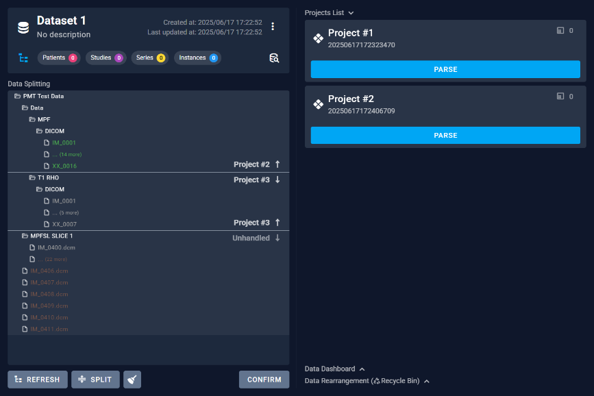

# 3.2 Configuration

Step 1: We will enter the software configuration stage, which is designated for configuring the software's database and operational environment. Please click "Next" at this point to proceed.

Step 2: Then, we will select the necessary components for installation. All of these components must be installed for the software correctly; hence they are all pre-selected by default. Please ensure all components are checked and then click the "Next" button. If users have already installed the corresponding components locally, they can skip the installation step and proceed directly to configuration.

Step 3: It is recommended to proceed with the default process for the installation packages that appear and complete the installation as prompted.

Step 4: Finally, we will reach the configuration interface. Users can choose to end the process directly at this point by selecting the default option, thus completing all installation steps.

