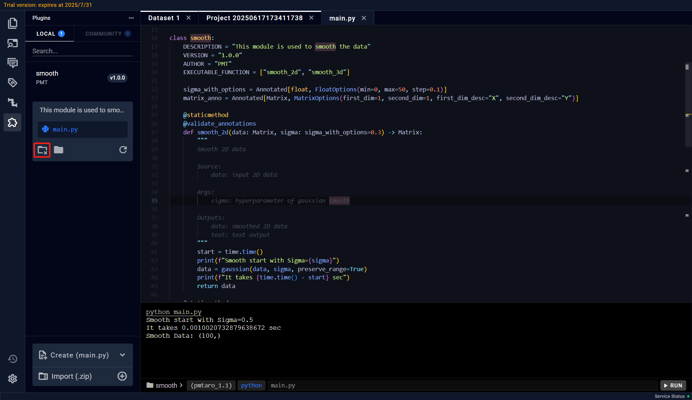
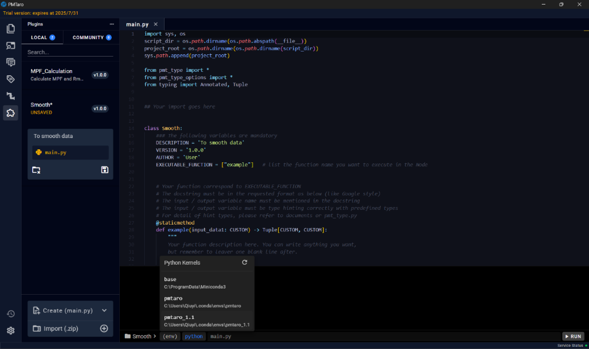

# 3.3 Activate the software (if necessary)

Step 1: When the user runs the software for the first time, the system will display an "Unregistered" prompt dialog.

Step 2: After clicking "OK", the software registration tool will open automatically.

Step 3: In the registration tool, click the "Copy" button to copy the Machine ID of the current device.

Step 4: Provide the copied Machine ID to the technical support team to obtain the license file `license.json`.

Step 5: After downloading and saving the license file, click the "..." button in the registration tool, select the downloaded `license.json` file, and click "Open".

Step 6: Click the "Activate" button. The system will verify the license file and display a confirmation dialog upon successful registration.

