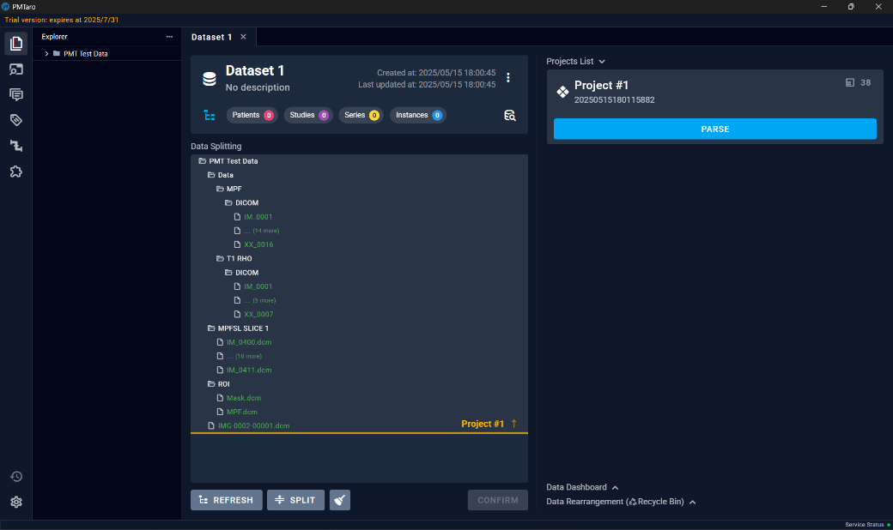
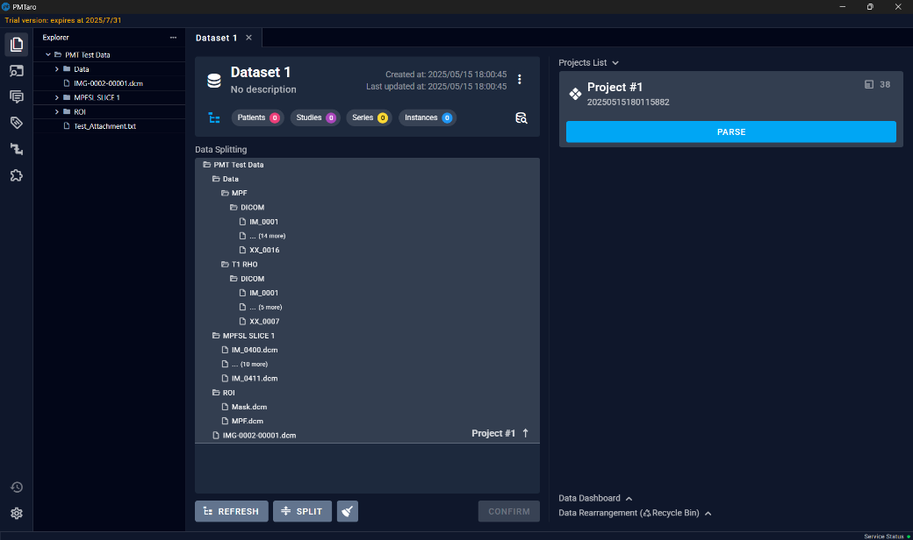

# 6.2 Prepare Dataset
After adding the folder address, the "PREPARE" button on the main interface's right side will become active. At this point, users can directly click the button to trigger the default manual split and parse. Users can also click the three dots next to the button and select automatic split and parse mode.

The interface after parsing is displayed below:

Within the "Explorer" section, users can continue to add new folders.
