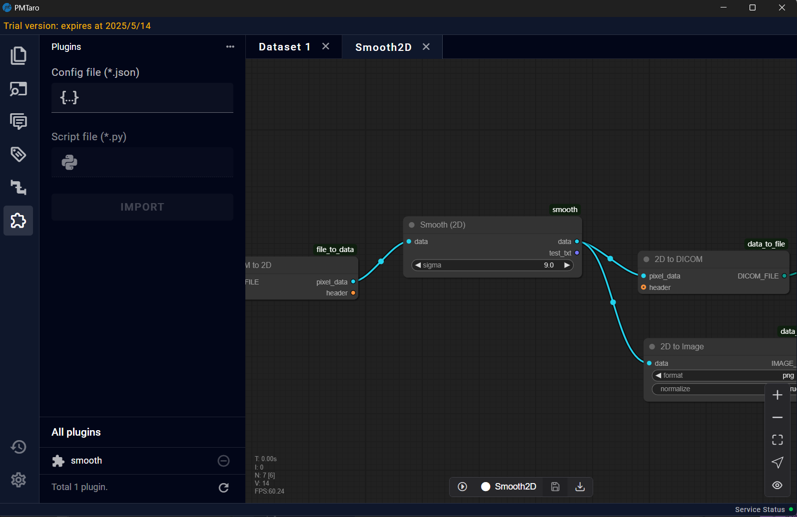
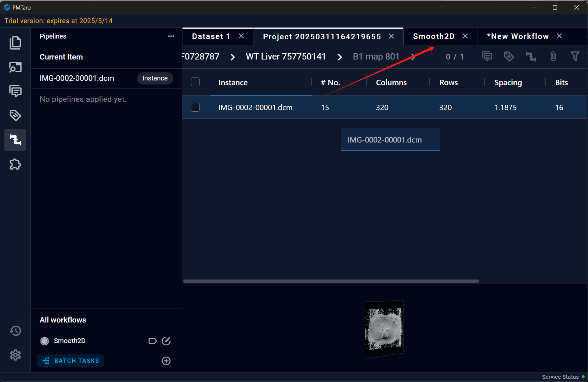

# 6.8 Data Retrieval
After completing the parsing process, clicking this button will open a "Data Retrieval" interface where users can perform operations such as searching for data and moving it. Click the "Database Query" icon to switch to the data status interface and view the data details.

## 6.8.1 Query Data
Users can query data by setting different search conditions to retrieve specific information from the data set. Two retrieval methods are designed here. One is to perform a large-scale, high-precision search between different levels through the tag information of the data, and the other is to directly perform keyword screening in the current data set.

## 6.8.2 Move Data
For the data retrieved, clicking on the arrow next to the series name allows you to view the data details. If you need to move the data, you can click the "ADD" button to add the data to the swap zone. Then, in the swap zone area, you can move or delete the data between projects.

## 6.8.3 Data Dashboard
After completing the parsing process, clicking “Data Dashboard “would appear some charts about the dataset.

a
Slide the scroll wheel to the bottom area, the software provides a custom Chart module. Users can right-click the mouse and design different chart types in the option bar to display the specific statistical information they want to view.
