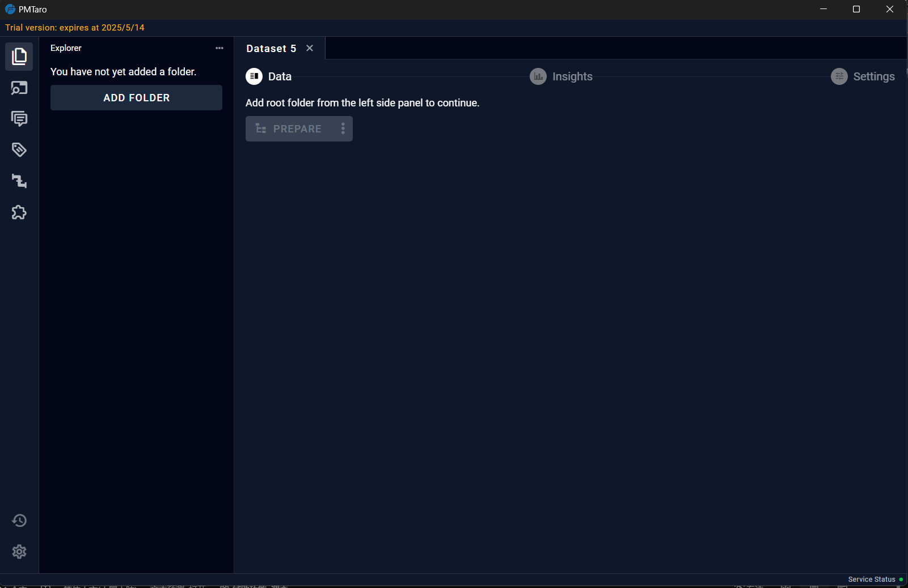

# 6.9 Settings
On the Settings page, users can perform data export and deletion.

## 6.9.1 Export
The Export button provides various export options for users to choose export format.

## 6.9.2 Delete
The delete button provides an additional verification step to prevent accidental deletions.
