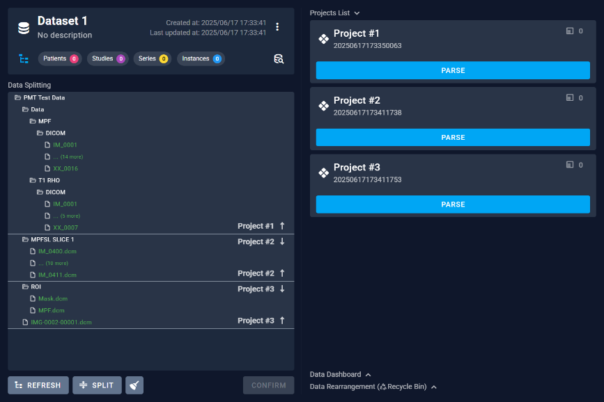

# 6.9 Settings

On the Settings page, users can perform data export and deletion.

## 6.9.1 Export

The Export button provides various export options for users to choose export format.

## 6.9.2 Delete

The delete button provides an additional verification step to prevent accidental deletions.

