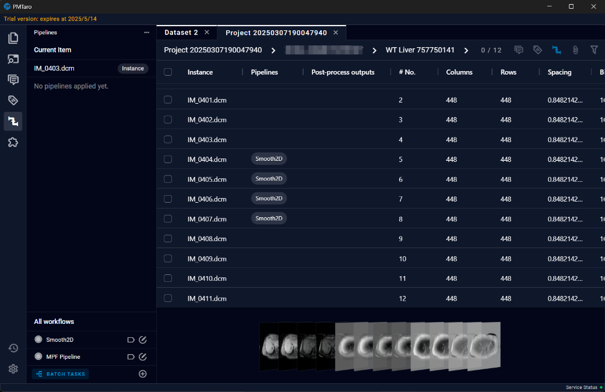

# 7.2 Labels
In the Labels section, users can create or edit labels in the Label list located in the bottom left corner. Users can add labels to corresponding data by using buttons. Additionally, a "Labels" column will be added to the table on the screen, making it convenient for users to view the labels associated with each data. Each data can have multiple labels assigned to it.
