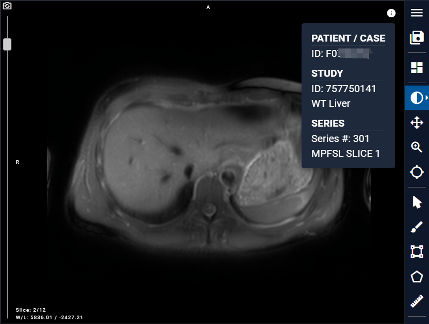

# 8.1 Image Interface
## 8.1.1 Reset Camera
Both the top left corner and the right toolbar in the interface provide a "Reset Camera" button, which allows users to reset all camera settings.

## 8.1.2 Data Info
In the top right corner of the image interface, there is an icon that can display basic information about the image.

