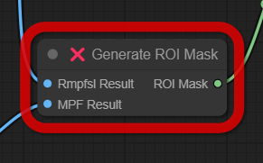
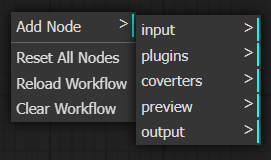
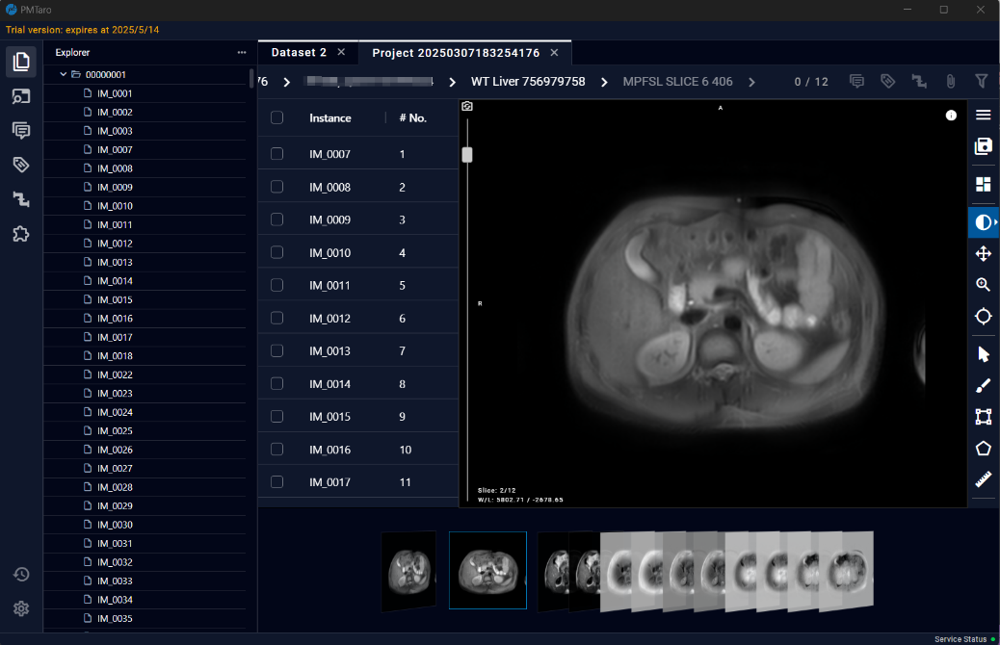
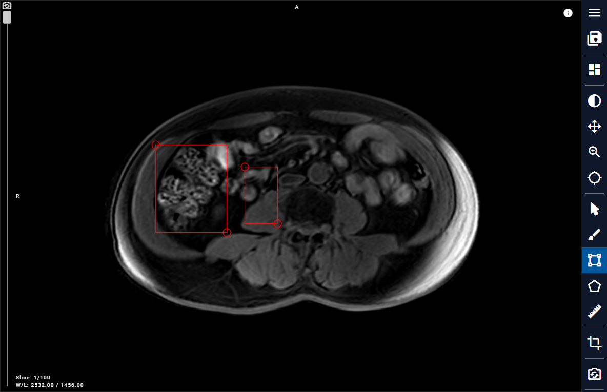

# 8.2 Data Interaction & Toolbar
## 8.2.1 Interaction Info List
In the toolbar on the right-hand side, the first button is "Interaction Info List", which consists of two sections: "Annotation" and "Rendering".
**Annotation****:**** **This module contains two sections: one part is about segment information, and the other part is about measurements information.

When the user is using the Paint tool, this list allows for setting properties of Paint tool. The upper part allows users to select the brush or eraser for drawing and adjust the brush size and ROI area transparency. The lower part is for managing multiple ROI groups, where each ROI group can be custom-named, hidden, downloaded, and deleted. The ROI group colors can be added, selected, and named.

When the user is using the measurement tool, users can also view completed annotations in this list. For completed measurements, users can perform operations such as reveal slice, visibility toggle, and delete.

**Rendering:**** **The module allows users to render data and adjust settings for cinematic rendering.

## 8.2.2 Layout Selection
On this page, users can select the layout interface and achieve 3D reconstruction. 

## 8.2.3 Window/Level (Contrast)
This button enables contrast adjustment functionality. We have incorporated default settings for image reading, along with four additional options: Full Range, Low Contrast, Medium Contrast, and High Contrast. Users can conveniently select these options based on their requirements. Users can also hold down the left mouse button on the image and move up and down to adjust the window level, and left and right to adjust the window width.

## 8.2.4 Pan
To pan, click on the Pan button, then hold down the left mouse button on the image and drag it to move the view.

## 8.2.5 Zoom
To zoom, click on the Zoom button in the toolbar, then hold down the left mouse button on the image and move up and down to zoom in and out.

## 8.2.6 Crosshair
To use the Crosshair feature, click on the Crosshair button in the toolbar. A cross-shaped crosshair will track the mouse cursor on the image. Click to lock the crosshair at the desired position.

## 8.2.7 Paint (Segmentation)
In the toolbar, select the "Paint" button to use the brush tool to select the region of interest (ROI) on the image. The software also provides a "Fill Between" function, which can use the morphological contour interpolation method to perform segmentation interpolation between slices.

## 8.2.8 Rectangle (Measurement)
In the Toolbar, click on the Rectangle button, then utilize the brush tool to select the ROI area on the image. Begin by selecting the starting point, and then confirm the endpoint to finish drawing a rectangular ROI.

## 8.2.9 Polygon (Measurement)
Within the Toolbar, locate and select the Polygon tool. Utilize the brush tool to outline the ROI on the image. Begin by choosing an initial point, then confirm each subsequent point by clicking the mouse. Continue this process until the final point coincides with the starting point, thus forming a closed shape and completing the drawing of the Polygon ROI area.

## 8.2.10 Ruler (Measurement)
Select the Ruler button in the Toolbar, then use the tool to choose a starting point on the image and confirm the endpoint to measure the distance between the two points.

## 8.2.11 3D Crop
Select the 3D Crop button in the Toolbar, then adjust the corner, edge, and side markers in the 3D window, and manipulate the edges of the bounding box overlaid on the data in the 2D windows to make precise adjustments.

## 8.2.13 Nifti File
For Nifti files, users can double-click the Nifti file in Explorer to open the file for browsing but cannot use other parsing tools such as Parse and Label.
