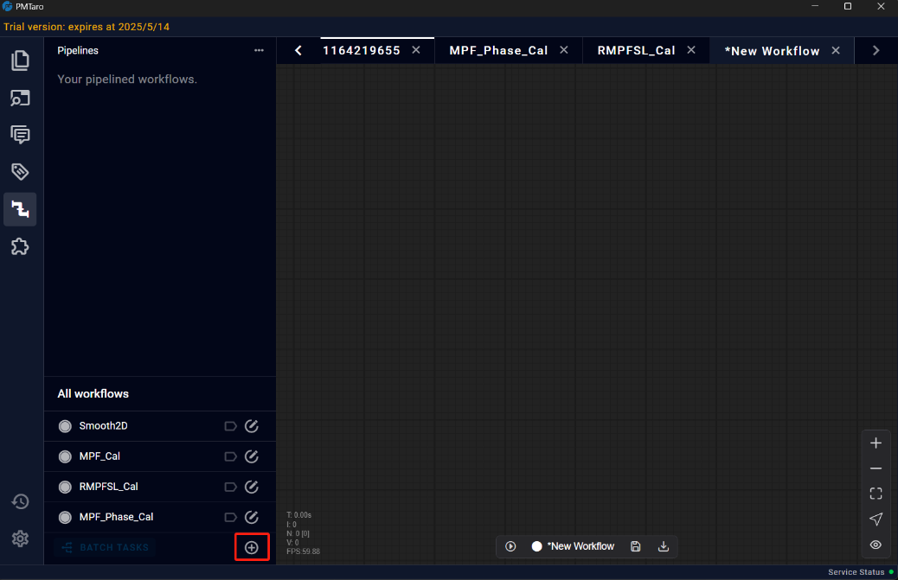
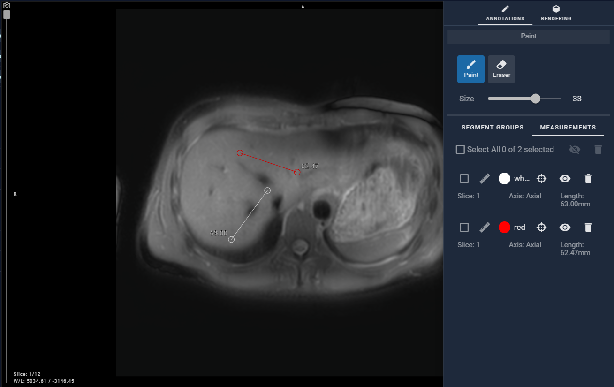

# 9.1 Node
## 9.1.1 Varieties of Nodes
The node system currently provides the following categories: Input, Plugins, Converters, Preview, and Output.
Input Node: This serves as the entry point for loading data that requires processing. Each pipeline must have exactly one Input Node - no more, no less.
Plugin Nodes: These are algorithmic nodes that execute either pre-configured or user-defined Python code to perform computational operations on the data.
Converter Nodes: These nodes handle data format conversions and transformations.
Preview Nodes: These invoke preview interface, allowing users to visualize both the raw data and intermediate data generated during the processing pipeline.
Output Node: This node determines whether and in what format the results should be saved to file.

## 9.1.2 Add Node
Right-click on any blank area of the workspace to access the main menu operations. Select the desired option to add it to workflow.

## 9.1.3 Node Setting
Right-click on a node in the workspace to access node-specific menu operations for the currently selected node. The Toolbar functions from left to right are: Reset Color, Pin, Delete, and Update Definition. The options panel on the right provides specific controls corresponding to each selected item's properties and settings.

## 9.1.4 Node status description
The workflow consists of multiple nodes, each of which exhibits distinct visual states during editing and execution phases.
During Editing:
Nodes can display three states:
Unselected nodes appear without borders

Selected nodes are highlighted with a white border, and their associated input/output links are also displayed in white

Nodes with initialization errors are marked with a red border, indicating the need for definition correction

During Execution:
Nodes transition through four distinct states:
Current: Indicated by a blue border, representing the node currently being processed
Pending: Marked with a yellow border, signifying nodes awaiting processing
Done: Displayed with a green border, denoting successfully completed nodes

Error: Highlighted with a red border, indicating nodes that encountered processing exceptions

The visual state system employs consistent color coding to provide immediate feedback on node status, facilitating efficient workflow monitoring and management.